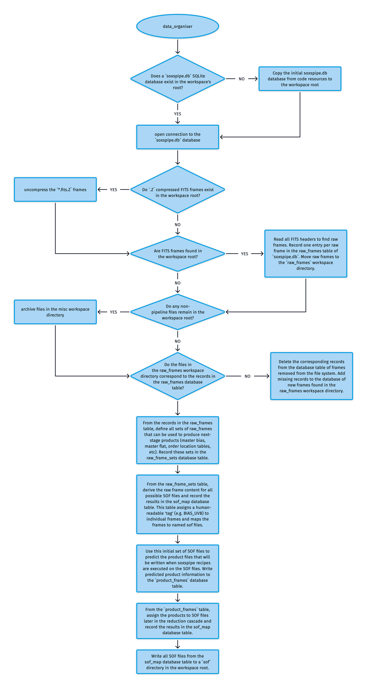

# Data Organiser

The data organiser (DO) is the backbone of the pipeline. It is required to sort and prepare data within a workspace, predict which products will be produced during data reduction, write out all of the [set-of-files (SOF)](../utils/set_of_files.md) files required by each of the soxspipe recipes and keep track of all data-products generated during the reduction cascade. The DO also provides functionality to rewrite SOF files on the fly if a recipe fails to produce a product required by a future recipe (e.g. a master flat frame), switching out the failed product for the next-best product (e.g. the next master flat frame generated closest in time to the recipe data). Finally, on subsequent executions of the pipeline, the organiser prevents data from being re-reduced if the products already exist (unless the user chooses to override this feature).

The algorithm the DO uses to prepare a workspace is shown in {numref}`data_organiser_util`.

:::{figure-md} data_organiser_util
{width=600px}

The algorithm used by the soxspipe data-organiser to prepare a workspace for data reduction.
:::

At the heart of the DO is a SQLite database called `soxspipe.db`. Here, the organiser's bookkeeping is performed, recorded, and maintained.

The ESO Science Archive Facility delivers FITS data in a `.Z` compressed format. When running `soxspipe prep`, the DO first finds and uncompresses any `.Z` compressed FITS frames within the workspace root. The DO then reads the FITS headers of all of the FITS frames in the workspace root and selects out the raw (unreduced) frames, recording one entry per raw frame in the `raw_frames` table of `soxspipe.db`. The DO then moves these raw frames to a `raw` directory within the workspace. Any remaining files are moved out of the workspace root and into a `misc` directory.

A sanity check is performed to ensure that the data in the `raw_frames` database table matches the data in the `raw` directory. If frames have been removed from the file system, the corresponding records in the database table are deleted. Also, frames within the `raw` directory missing from the database table are added.

The next step is for the DO to define all sets of raw frames that can be used to produce next-stage products (master bias, master flat, order location tables, etc). The rules for these associations are read from the `soxs_sof_map.yaml` file is shipped with the pipeline code. These sets are recorded sets in the `raw_frame_sets` database table. These raw frame sets derive the raw frame content for all possible SOF files, which are recorded in the `sof_map` database table, assigning a human-readable 'tag' (e.g. BIAS_UVB) to individual frames and mapping the frames to named sof files. 

The initial set of SOF files in the `sof_map` table is used to predict the product files written when soxspipe recipes are executed on the SOF files. The expected product information is written to a `product_frames` database table. From this `product_frames` table, products are assigned to SOF files later in the reduction cascade (recorded again in the `sof_map` table). 

Finally, all SOF files from the `sof_map` table are written to a sof directory in the workspace root and are ready to be used by the various soxspipe recipes during a data-reduction session.

During the running of each pipeline recipe, Quality Control (QC) metrics are generated, and within the pipeline settings file, there are `qc-acceptable-ranges` for each recipe. These acceptable ranges act as guardrails for the pipeline, so that if a QC metric falls outside an acceptable range, the pipeline forces a 'fail' on this data, preventing it from cascading into further data-reduction stages.

### Late-arriving frames

A raw frame can reach the workspace after its set was grouped, for example when the last exposures of a template run are downloaded later. On a plain `soxspipe prep`, the DO adds such a frame to the existing set instead of creating a second set.

A late frame is a raw frame that is not yet processed and is in no SOF. It joins an existing set when both of these are true:

- It has the same value as the set's frames for every grouping key.
- It has the same `eso tpl start` value, so it comes from the same template run.

When a late frame joins a set, the DO does these things in the same `prep` run:

1. The set keeps its SOF name. The new SOF file is written under the old name.
2. The status of the set's products is reset to NULL in every session, so each session queues the set to run again.
3. The set's stale product file and its `_ERROR.log` file are deleted. This happens at `prep`, not at `reduce`.
4. The DO prints a line that names the SOFs that gained late frames.

A frame from a different template run has a different `eso tpl start` value. It does not join the set and forms a new SOF.

The DO does not add a late frame to a set in these cases:

- The frame has no `eso tpl start` value.
- The frame comes from a technique that the DO groups one exposure at a time (`ECHELLE,SLIT,STARE`, `ECHELLE,PINHOLE` and `ECHELLE,MULTI-PINHOLE`).
- The frame is an NIR `IMAGE` frame that is not a `DARK`. The grouping leaves these frames out.

#### Limits

- Only the current session's `sof_map` rows for the set are removed. The other sessions keep their own `sof_map` rows for the set, although their statuses are reset.
- Products that are downstream of the rejoined set are not queued again. This is tracked as DY-264.
- The SOF name is kept for one `prep` run only. The name is held in memory. If the set is still unprocessed when the run ends (for example, while a calibration is missing), a later `prep` names the set after its earliest frame.
- `soxspipe prep --refresh` rebuilds the database and groups all frames again. It does not keep the old SOF names in this way.

### Utility API

:::{autodoc2-object} soxspipe.commonutils.data_organiser.data_organiser
:::

