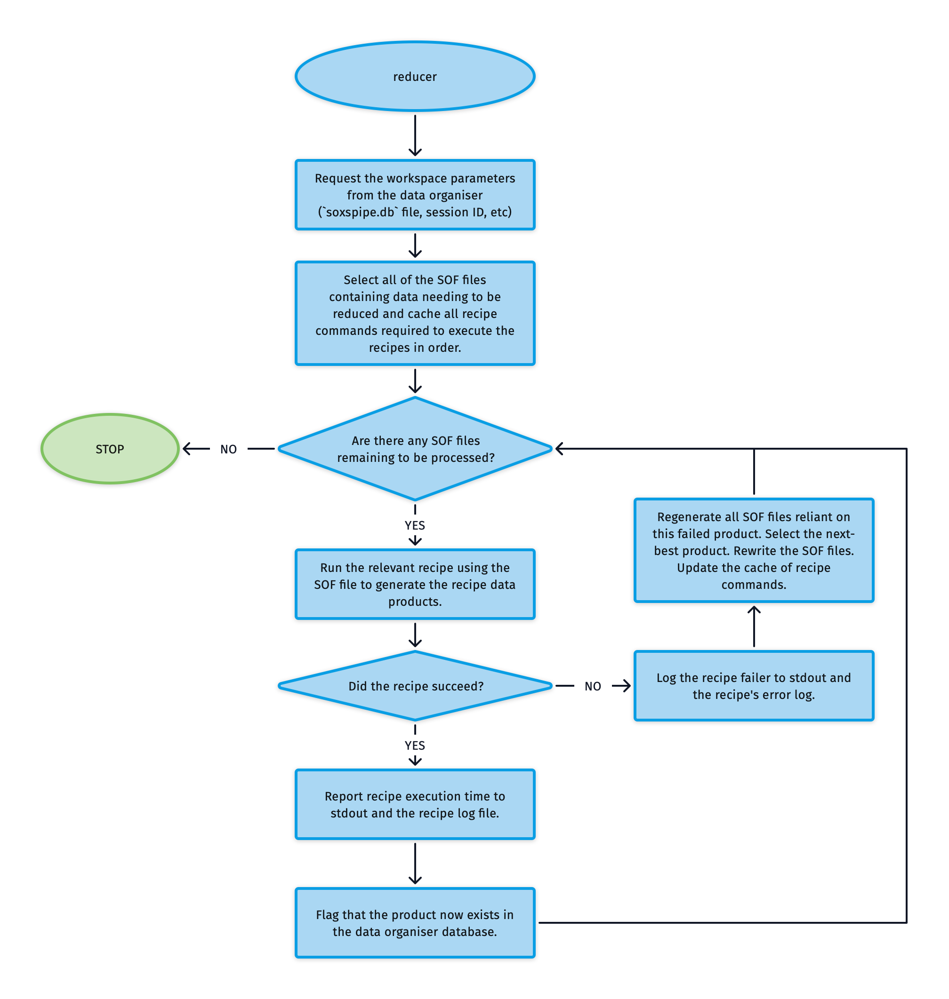

# Reducer

The `reducer` utility is designed to interact with the data organiser to reduce all data within a workspace, from the most basic calibration frames (bias, darks) through the data-reduction cascade to a final wavelength- and flux-calibrated object spectrum. Using the `reducer` utility and its command-line counterpart (`soxspipe reduce`) allows typical users to run the pipeline at a high level without worrying about individual recipe commands. Of course, those individual recipe commands are still available for 'power-users' to run with their own customised settings.

The algorithm used by the `reducer` util is shown in {numref}`reducer_util`.

:::{figure-md} reducer_util
{width=600px}

The algorithm used by the reducer utility to process data through the entire data-reduction cascade.
:::

The reducer utility first selects from the `soxspipe.db` database, all SOF files containing data still needing to be reduced and caches all recipe commands required to execute the recipes in order. It then executes the relevant recipes (in order) to generate the new data products. If, at any stage, a recipe fails to create a data product, the SOF files get rewritten to remove the failed product and insert the next-best product. The reducer utility stops when all the SOF files have been processed.

The pipeline can utilise multiprocessing to run recipes in parallel (by passing a `--multiprocess` flag. It is also possible to target specific science sof files so that the pipeline will only reduce the calibrations needed to process that specific science object.

### Utility API

:::{autodoc2-object} soxspipe.commonutils.reducer.reducer
:::

