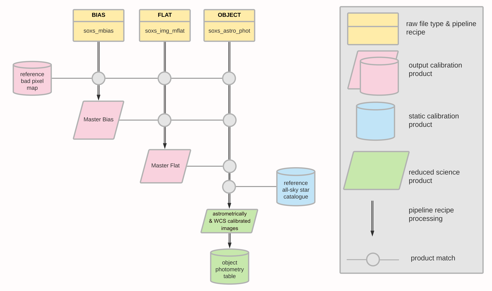

The association map in {numref}`acq_cascade_image` shows how imaging data cascades through the pipeline.

:::{figure-md} acq_cascade_image
:target: ../../_images/image-20240906161055310.png
{width=600px}

The SOXS imaging data reduction cascade. The input data, calibration products required and the output frames are shown for each recipe implemented in the pipeline. Each vertical line in the map depicts a raw data frame, the specific recipe to be applied to that frame and the data product(s) output by the recipe. Horizontal lines show how subsequent pipeline recipes use those output data products. Time loosely proceeds from left to right (recipe order) and top to bottom (recipe processing steps) on the map. 

:::
