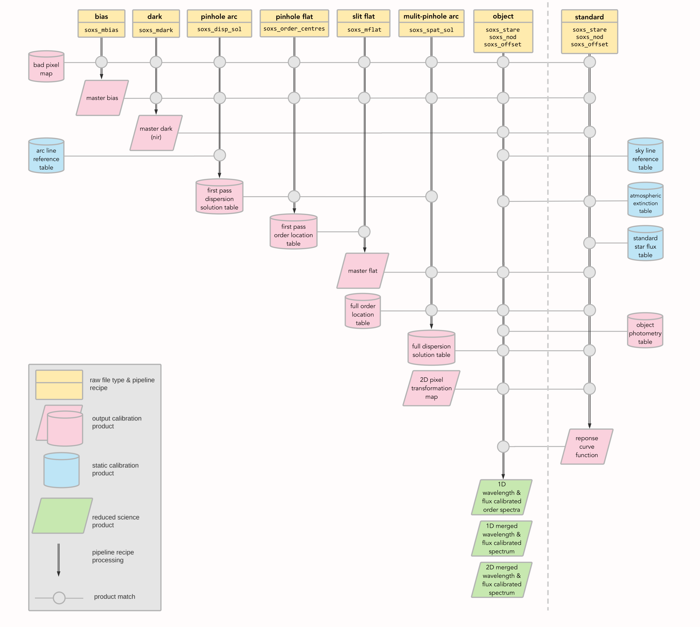

One of the most challenging problems the SOXS pipeline has to overcome is the curvature of the NIR spectral orders. Also, although the UVB-VIS orders should be aligned linearly along the CCD columns, the observed emission lines will not be perpendicular to the source trace but exhibit a slight tilt that must also be accounted for.

Here brief overview of the individual reduction steps performed by the pipeline on the spectroscopic data (also shown in 
{numref}`spectroscopic_cascade_map`):

1. Individual object frames are prepared by trimming and adding bad-pixel and error map extensions.
2. The bias current is removed, either via subtraction of a master bias frame (stare mode) or via the A-B and B-A cycle subtractions (nodding and offset modes).
3. Any dark current is removed, either via the subtraction of a master dark frame (NIR only) or via the A-B and B-A cycle subtractions (nodding and offset modes).
4. Frames are divided by a master-flat frame.
5. The inter-order background (mainly due to scattered light registering on the detector) is fitted and removed from the frames.
6. The signal from the sky background is either modelled from the object frame and removed (stare mode) or removed during A-B and B-A cycle subtractions (nodding and offset modes).
7. The object signal is traced and optimally extracted from individual orders in the original detector pixel space. By not interpolating the data into rectified (non-curved) orders, the pipeline avoids introducing extra correlated noise into the data. Additionally, a simple boxcar extraction is performed on the object trace.
8. The individual order extractions are merged into a single spectrum.
9. The identical processes above are applied to a flux standard star, taken close in time to the science object, and the order-merged extraction of this standard star is compared against its catalogued calibrated spectrum to determine the instrument's response function.
10. The object spectrum is flux-calibrated with the response curve calculated in the previous step.
11. Since the arc-lamp frames used to determine the dispersion solution are taken during the afternoon, a check of the wavelength calibration is made using the position of sky emission lines. Any systematic offset observed in the extracted spectra is corrected for (YET TO BE IMPLEMENTED).
12. The ESO package MOLECFIT is run on the flux and wavelength-calibrated 1D spectra to remove the telluric absorption (YET TO BE IMPLEMENTED).
13. In addition to the 1D reduced and calibrated spectra, a flux and wavelength-calibrated, order-merged 2D image is produced. This will allow users to extract their 1D spectrum.
14. Finally, using the wavelength overlap between the arms to cross-calibrate flux, the order-merged 1D extractions from the individual arms are merged to form a single object extraction.

For more details on the individual reduction stages, see the [recipes](#recipes-section) section.

:::{figure-md} spectroscopic_cascade_map

{width=800px}

The SOXS spectroscopic data reduction cascade.  The input data, calibration products required and the output frames are shown for each pipeline recipe implemented in the pipeline. Vertical lines in the map depict a raw data frame, the specific recipe to be applied to that frame and the data product(s) output by that recipe. Horizontal lines show how subsequent pipeline recipes use those output data products. Time loosely proceeds from left to right (recipe order) and top to bottom (recipe processing steps) on the map. To the right of the grey dashed line are input calibration products generated from a separate pipeline processing cascade. 
:::

