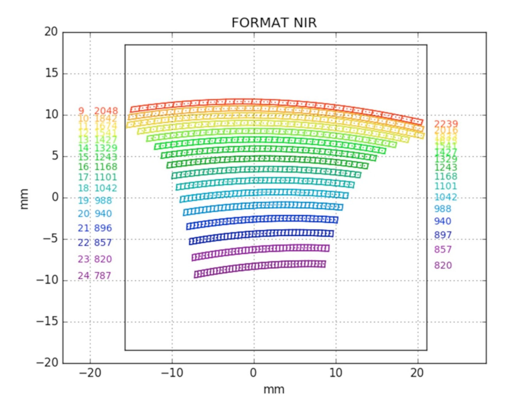
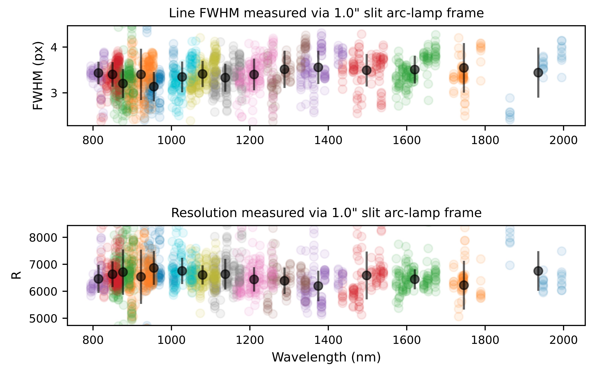
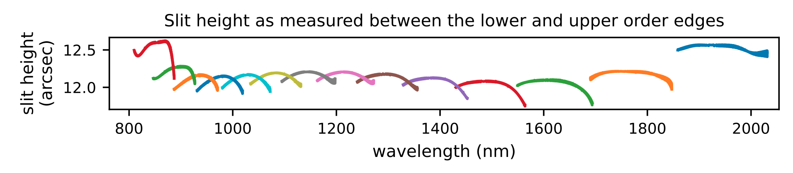
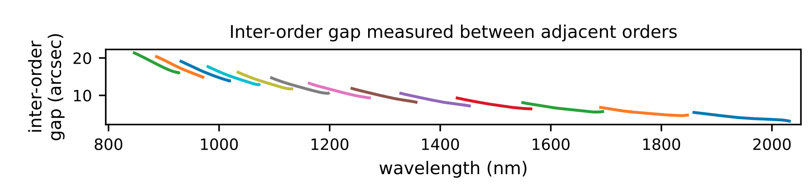

## NIR Spectrograph

:::{table} SOXS NIR Spectrograph/Array Characteristics

| Parameter                   | Value                                                        |
| --------------------------- | :----------------------------------------------------------- |
| Detector                    | Teledyne H2RG                                                |
| Pixel-Size                  | 18 μm                                                        |
| Array-Size                  | 2048 $\times$ 2048 px                                        |
| Array-Scale                 | 0.25 arcsec/px                                               |
| Read noise (RMS)            | Double correlated: $< 20 e^{-}$   16 Fowler pairs $< 7 e^{-}$ |
| Dark current @ 40K          | $< 0.005 {e^{-}/s/px}$                                       |
| Resolution $(R)$            | $\simeq$ 5000 (1 arcsec slit)                                |
| Wavelength Range            | 800-2000 nm                                                  |
| Slit Widths                 | 0.5, 1.0, 1.5, 5.0 arcsec                                    |
| Slit Height                 | 12 arcsec                                                    |
| Grating Blaze Angle         | 44°                                                          |
| Detector Operating Temp     | 40K                                                          |
| Spectrograph Operating Temp | 150K                                                         |
| Orders                      | 15                                                           |
| Penrays                     | Ar-Ne-Xe-Hg                                                  |

:::

As described in {cite:t}`vitali2018b`, the SOXS NIR spectrograph is a near-infrared, cross-dispersed echelle spectrograph, with $R=5000$ (for a one-arcsec slit). It employs '4C' (Collimator Correction of Camera Chromatism) to cover a wavelength range from 800 to 2050nm over 15 orders. This wavelength range provides a 50nm overlap with the SOXS UV-VIS arm for cross-calibration. 

As with the UV-VIS, four slits options ($0.5$, $1$, $1.5$ and $5$ arcsec) are provided, which will project a FWHM for an unresolved spectral line onto four detector pixels. A slit height of 12 arcsecs is employed. The detector is a $2k\times2k$ 18-micron pixel Teledyne H2RG TM array. As atmosphere dispersion is less severe in the NIR regime, unlike the UV-VIS arm, the NIR arm does include an atmosphere dispersion corrector (ADC). The SOXS NIR spectral arm achieves a resolution $R > 6000$, for a 1 arcsec slit, across all dispersion orders (as seen in {numref}`nir_resolution`).

:::{figure-md}
{width=600px}

A SOXS flat-lamp calibration image.
:::

:::{figure-md}
{width=600px}

The SOXS NIR spectral format, Figure 5 of {cite:t}`vitali2018b`. The inter-order gap is always >10px.
:::

:::{figure-md} nir_resolution
{width=600px}

The spectral resolution of the SOXS NIR spectral arm. This plot is generated during the execution of the `soxs_spatial_solution` recipe. For selected lines resulting from Ar-Ne-Hg-Xe penray lamps, imaged through a 1 arcsec slit, the FWHM is measured at nine locations along the length of the slit. In the top panel, the measured FWHMs are displayed with respect to the wavelengths of the lines. The different coloured circles represent the unique dispersion orders of the spectrograph, and the black circles (with error bars) represent the mean FWHM for the order (and standard deviation). In the bottom panel, the measured pixel scale from the dispersion solution is used to convert FWHM to spectra resolution $R$. For a 1 arcsec slit, the SOXS NIR detector achieves a resolution $R > 6000$ across all orders. The wavelengths of the arc-lines detected range from $795-1995 \mathrm{nm}$.

:::

:::{figure-md} nir_slit_height

The NIR slit-height as measured between the edges of each dispersion order on an d NIR through-slit flat frame. Each colour in the plot represents an individual dispersion order. The slit height is measured at $\sim$12 arcsecs across all orders, as expected.

:::

:::{figure-md} nir_slit_gap

The NIR inter-order gaps as measured between the edges of adjacent dispersion orders on an NIR through-slit flat frame. Each colour in the plot represents an individual dispersion order. The minimum inter-order gap is $\sim$6 arcsecs.

:::
