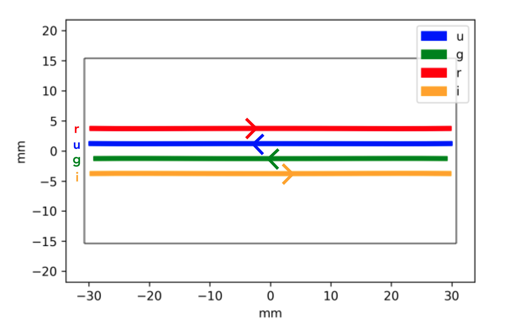
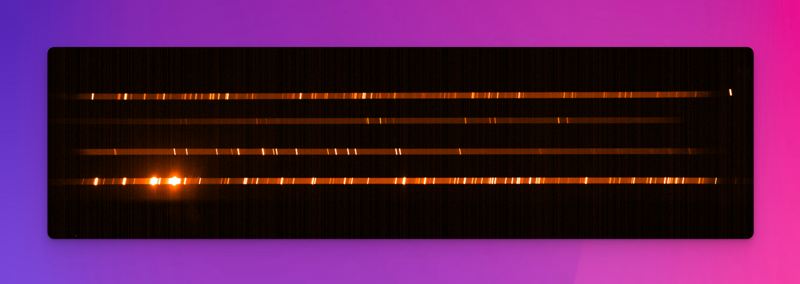
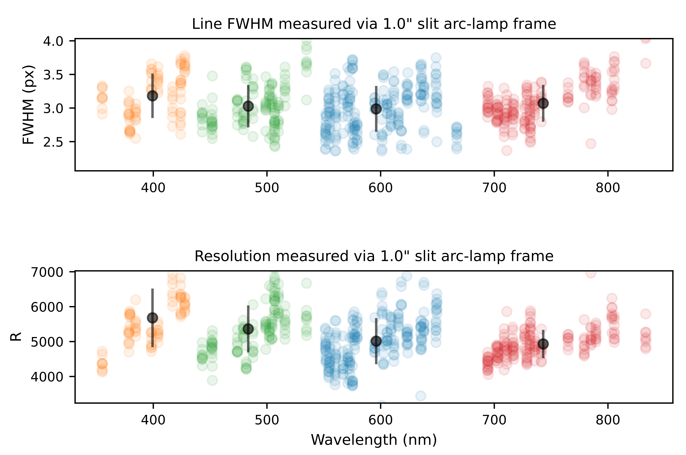
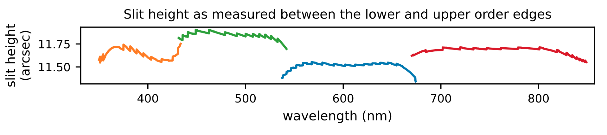

## UVVIS Spectrograph

:::{table} SOXS UV-VIS Spectrograph/CCD Characteristics

| Parameter           | Value                                                        |
| ------------------- | ------------------------------------------------------------ |
| Detector            | e2V CCD44-82                                                 |
| Pixel-Size          | 15 μm                                                        |
| Array-Size          | 2048 $\times$ 4096 px; 30.7 x 61.4 mm                        |
| Array-Scale         | 0.28 arcsec/px                                               |
| Peak Signal         | 200,000 $e^{-}/px$                                           |
| Gain                | Slow: 0.6 $\pm$ 0.1  $e^{-}/ADU$   Fast: 2 $\pm$ 0.2 $e^{-}/ADU$ |
| Read noise (rms)    | Slow: <3 $e^{-}$  Fast: <8 $e^{-}$                        |
| Dark current @ 153K | < 0.00001$e^{-}/s/px$                                        |
| Resolution ($R$)    | 3500-7000 ($\simeq$ 4500 mean)                               |
| Wavelength Range    | 350-850nm                                                    |
| Slit Widths         | 0.5, 1.0, 1.5, 5.0 arcsec                                    |
| Slit Height         | 11 arcsec                                                    |
| Grating Blaze Angle | 41°                                                          |
| Orders (quasi)      | 4                                                            |

:::

As shown in {numref}`uvis_format`, the SOXS UV-VIS arm has four dispersing elements, each of which produces a dispersed beam, or pseudo-order (u, g, r, i), which are then all imaged onto the 4k x 2k e2v CCD44-82 device (15$\mu$m pixels).  Unlike a typical echelle spectrograph, no order curvature exists for any of these four orders {cite:p}`{see}cosentino2018,sanchez2018a,rubin2020`. The straight orders do not align precisely along a detector row but are tilted in the dispersion direction by a few pixels. As with the NIR, the slit height in $12''$. The SOXS UV-VIS spectra arm achieves a resolution $R > 5000$ , for a 1 arcsec slit, in all four orders (as seen in {numref}`uvis_resolution`).

:::{figure-md} uvis_format
{width=600px}

SOXS UV-VIS spectral format, Figure 4 of {cite:t}`sanchez2018a` modified to show the dispersion direction for each pseudo-order.

:::

The object trace in these orders is straight, but the skylines are not perpendicular to the object spectrum but are tilted in the cross-dispersion direction (see {numref}`uvis_xenon`).

The full UV-VIS wavelength range is 350 – 850nm (providing a 50nm overlap with the NIR arm for cross-calibration), and with the deep-depleted CCD42-82 device, fringing in the red part of the spectrum is below $5\%$ and, therefore, the pipeline does not perform any fringing corrections. Also, due to the CCD's low dark current, calibration dark frames are not required. Unlike the NIR arm, the UV-VIS arm *will* include an ADC.

:::{figure-md} uvis_xenon
{width=600px}

A SOXS UV-VIS Xenon arc lamp frame. The arc lines are not perpendicular to the dispersion axis, but tilted in the cross-dispersion direction.

:::

:::{figure-md} uvis_resolution
{width=600px}

The spectral resolution of the SOXS UV-VIS spectral arm. This plot is generated during the execution of the `soxs_spatial_solution` recipe. For selected lines resulting from a QTH-lamp imaged through a 1 arcsec slit, the FWHM is measured at nine locations along the length of the slit. In the top panel, the measured FWHMs are displayed with respect to the wavelengths of the lines. The orange, green, blue and red circles represent the $u, g, r$ and $i$ pseudo orders of the spectrograph, and the black circles (with error bars) represent the mean FWHM for the order (and standard deviation). In the bottom panel, the measured pixel scale from the dispersion solution is used to convert FWHM to spectra resolution $R$. For a 1 arcsec slit, the SOXS UV-VIS detector achieves a resolution $R > 5000$ in all four orders. The wavelengths of the arc-lines detected range from $355-833 \mathrm{nm}$.

:::

:::{figure-md} vis_slit_height

The UV-VIS slit-height as measured between the edges of each dispersion order on a UV-VIS through-slit flat frame. Each colour in the plot represents an individual dispersion order. The slit height is measured close to the expected $\sim$12 arcsecs across all orders.

:::

:::{figure-md} vis_slit_gap

The UV-VIS inter-order gaps as measured between the edges of adjacent dispersion orders on an UV-VIS through-slit flat frame. Each colour in the plot represents an individual dispersion order. The minimum inter-order gap is $\sim$28 arcsecs.

:::

