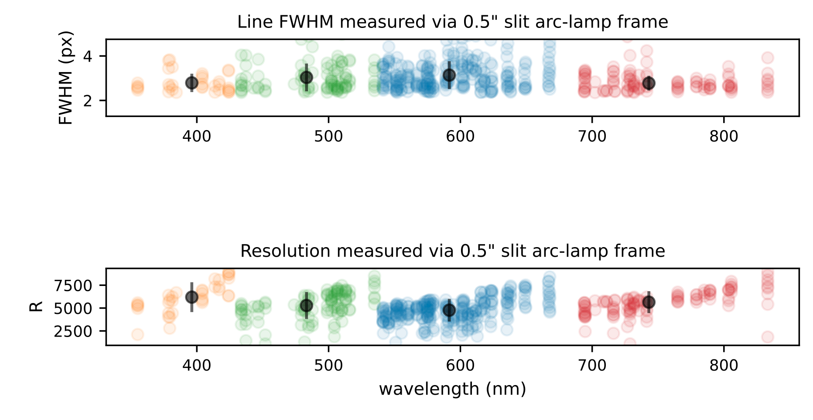
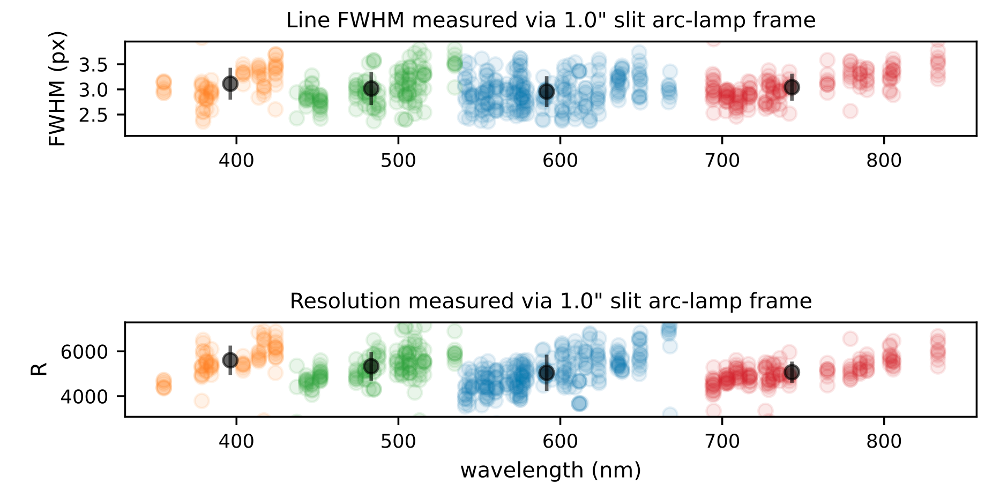
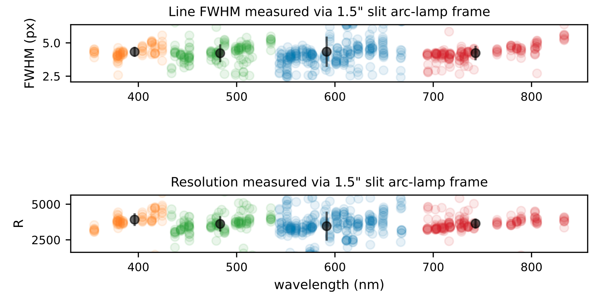
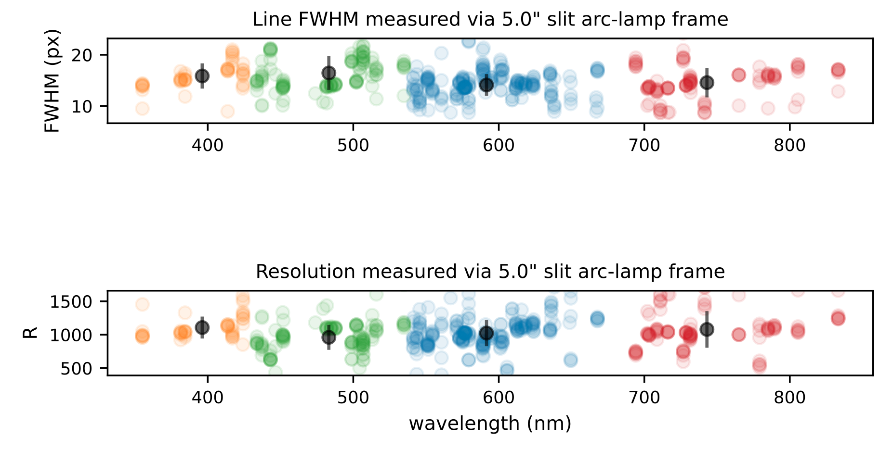
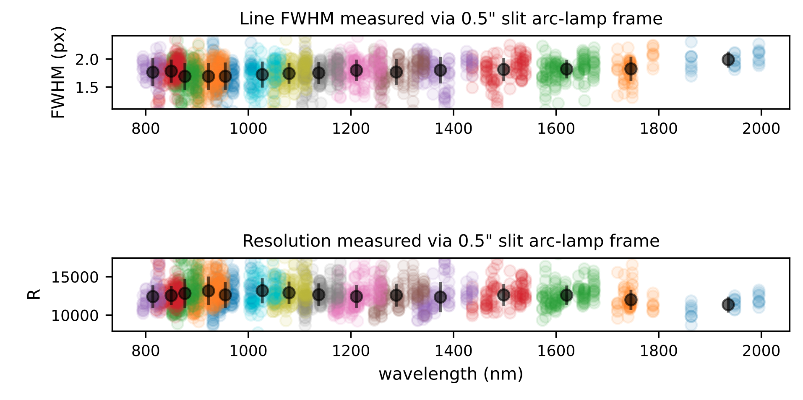
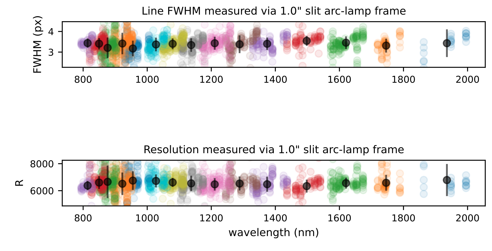
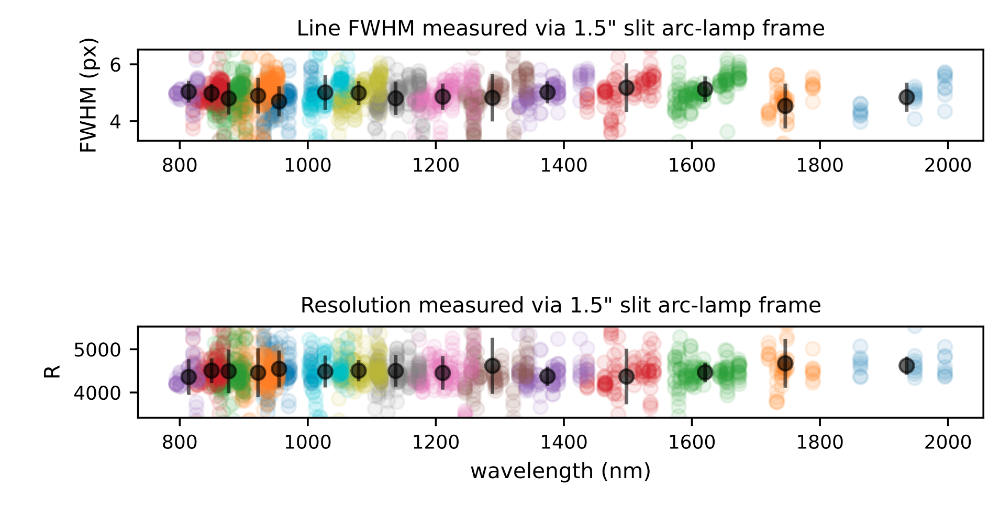
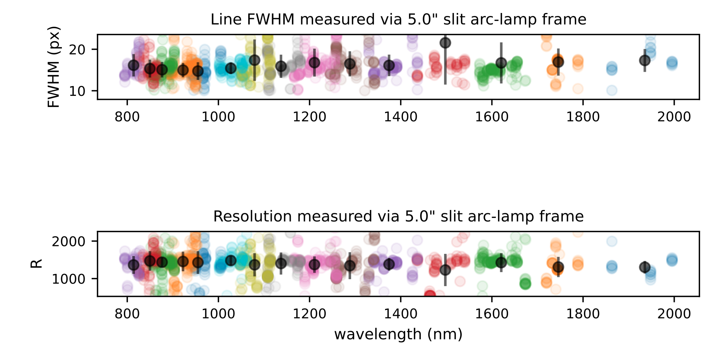

# THIS TITLE IS NEEDED FOR THE OVERLEAF SECTION HEADERS TO BE WRITTEN CORRECTLY

## Appendix

### UV-VIS & NIR Resolution Plots

:::{figure-md} uvvis_res_0.5
{width=600px}

The spectral resolution of the SOXS UV-VIS spectral arm. This plot is generated during the execution of the `soxs_spatial_solution` recipe. For selected lines resulting from a QTH-lamp imaged through a 0.5 arcsec slit, the FWHM is measured at nine locations along the length of the slit. In the top panel, the measured FWHMs are displayed with respect to the wavelengths of the lines. The orange, green, blue and red circles represent the $u, g, r$ and $i$ pseudo orders of the spectrograph, and the black circles (with error bars) represent the mean FWHM for the order (and standard deviation). Multiplying the mean FWHM by the pixel scale (0.28 $\mathrm{arcsec/px}$) we recover a slit-width close to the 0.5 arcsec used. In the bottom panel, the measured pixel scale from the dispersion solution is used to convert FWHM to spectra resolution $R$.

:::

:::{figure-md} uvvis_res_1.0
{width=600px}

As above but with selected lines resulting from a QTH-lamp imaged through a 1.0 arcsec slit. Multiplying the mean FWHM by the pixel scale (0.28 $\mathrm{arcsec/px}$) we recover a slit-width close to the 1.0 arcsec used. 

:::

:::{figure-md} uvvis_res_1.5
{width=600px}

As above but with selected lines resulting from a QTH-lamp imaged through a 1.5 arcsec slit. Multiplying the mean FWHM by the pixel scale (0.28 $\mathrm{arcsec/px}$) we recover a slit-width close to the 1.5 arcsec used. 
:::

:::{figure-md} uvvis_res_5.0
{width=600px}

As above but with selected lines resulting from a QTH-lamp imaged through a 5.0 arcsec slit. Multiplying the mean FWHM by the pixel scale (0.28 $\mathrm{arcsec/px}$) we recover a slit-width close to the 5.0 arcsec used. 
:::

:::{figure-md} nir_res_0.5
{width=600px}

The spectral resolution of the SOXS NIR spectral arm. This plot is generated during the execution of the `soxs_spatial_solution` recipe. For selected lines resulting from Ar-Ne-Hg-Xe penray lamps, imaged through a 0.5 arcsec slit, the FWHM is measured at nine locations along the length of the slit. In the top panel, the measured FWHMs are displayed with respect to the wavelengths of the lines. The different coloured circles represent the unique dispersion orders of the spectrograph, and the black circles (with error bars) represent the mean FWHM for the order (and standard deviation). Multiplying the mean FWHM by the pixel scale (0.25 $\mathrm{arcsec/px}$) we recover a slit-width close to the 0.5 arcsec used. In the bottom panel, the measured pixel scale from the dispersion solution is used to convert FWHM to spectra resolution $R$. 

:::

:::{figure-md} nir_res_1.0
{width=600px}

As above but with selected lines resulting from Ar-Ne-Hg-Xe penray lamps, imaged through a 1.0 arcsec slit. Multiplying the mean FWHM by the pixel scale (0.25 $\mathrm{arcsec/px}$) we recover a slit-width close to the 1.0 arcsec used.

:::

:::{figure-md} nir_res_1.5
{width=600px}

As above but with selected lines resulting from Ar-Ne-Hg-Xe penray lamps, imaged through a 1.5 arcsec slit. Multiplying the mean FWHM by the pixel scale (0.25 $\mathrm{arcsec/px}$) we recover a slit-width close to the 1.5 arcsec used.

:::

:::{figure-md} nir_res_5.0
{width=600px}

As above but with selected lines resulting from Ar-Ne-Hg-Xe penray lamps, imaged through a 5.0 arcsec slit. Multiplying the mean FWHM by the pixel scale (0.25 $\mathrm{arcsec/px}$) we recover a slit-width close to the 5.0 arcsec used.

:::

