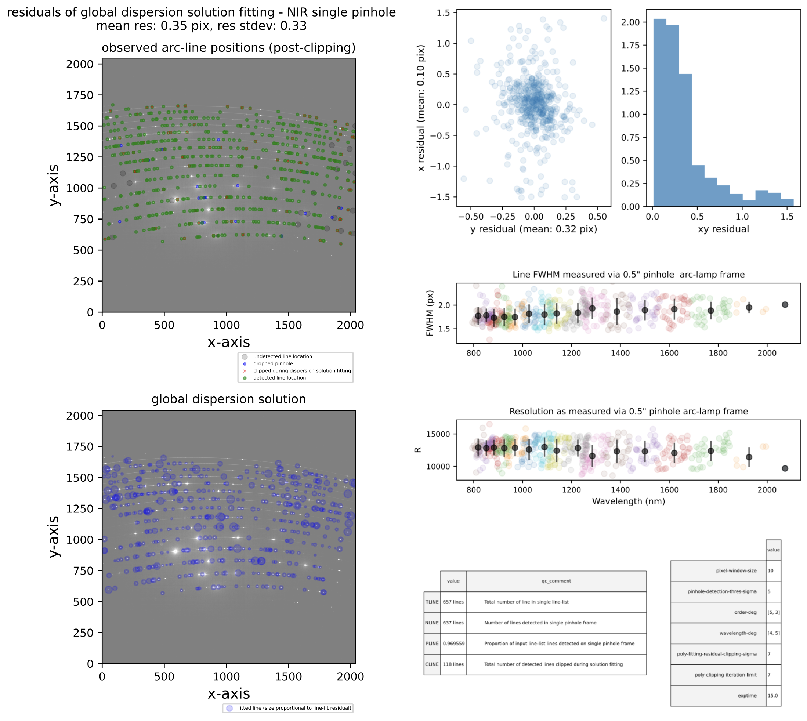

# soxs_disp_solution

:::{include} ./descriptions/soxs_disp_solution.inc
:::

## Input

:::{include} ./inputs/soxs_disp_solution.inc
:::

:::{include} ./static_files/soxs_disp_solution.inc
:::

## Parameters

:::{include} parameters/soxs_disp_solution.inc
:::

## Method

After preparing and calibrating the single-pinhole arc-lamp frame, the [`create_dispersion_map`](../utils/create_dispersion_map.md)) util is employed to detect and measure the positions of the arc lines on the frame. Once the line positions have been measured, a dispersion solution is generated by iteratively fitting a global polynomial against the observed line positions (see [`create_dispersion_map`](../utils/create_dispersion_map.md) for details). The algorithm used in the [`soxs_disp_solution`](#soxspipe.recipes.soxs_disp_solution) recipe is shown in {numref}`soxs_disp_solution_diagram`. Note that saturated arc-lines are either absent from the input line-list file or get clipped during the fitting process and so are not included in the final dispersion solution fitting. 

:::{figure-md} soxs_disp_solution_diagram
{width=600px}

The `soxs_disp_solution` recipe algorithm. At the top of the diagram, NIR input data is found on the right and VIS on the left. 
:::

## Output

:::{include} output/soxs_disp_solution.inc
:::

## QC Metrics

:::

:::{include} qcs/soxs_disp_solution.inc
:::

The typical solution for the `soxs_disp_solution` recipe has sub-pixel residuals.

:::{figure-md} soxs_disp_solution_qc

A QC plot resulting from the `soxs_disp_solution` recipe as run on a SOXS NIR single pinhole arc lamp frame. A 'good' dispersion solution will have sub-pixel residuals (mean residuals $<$ 0.5 pixels). The top-left panel shows an SOXS NIR arc-lamp frame, taken with a single pinhole mask. The green circles represent arc lines detected in the image, and the blue circles and red crosses were detected but dropped due to poor DAOStarFinder fitting or clipped during the polynomial fitting, respectively. The grey circles represent arc lines reported in the static calibration table that failed to be detected on the image.  The bottom-left panel shows the same arc-lamp frame with the dispersion solution overlaid at the pixel locations modelled for the original lines in the line list. The top-right panels shows the residuals of the dispersion solution fit, and the final panels (bottom-right) the resolution measured for each line (as projected through the pinhole mask) with different colours for each echelle order and the mean order resolution in black.

:::

## Recipe API

:::{autodoc2-object} soxspipe.recipes.soxs_disp_solution.soxs_disp_solution
:::
