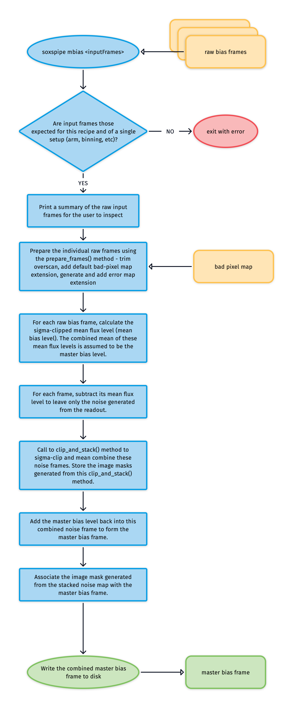

# soxs_mbias

A zero-second exposure will contain only read-noise, and \~half of the pixels within this Gaussian distribution centred around zero counts will always contain negative flux. To avoid negative counts, an offset *bias* voltage is applied at the amplifier stage so that even when no photons are detected, the A/D converter will always register a positive value. This bias-voltage offset must be accounted for in the data reduction process. 

The purpose of the [`soxs_mbias`](#soxspipe.recipes.soxs_mbias) recipe is to provide a master-bias frame that can be subtracted from science/calibration frames to remove the contribution of pixel counts resulting from the bias voltage.

## Input

:::{include} inputs/soxs_mbias.md
:::

## Parameters

:::{include} parameters/soxs_mbias.md
:::

## Method

The purpose of the [`soxs_mbias`](#soxspipe.recipes.soxs_mbias) recipe is to stack raw bias frames together (using the [`clip_and_stack`](../utils/clip_and_stack.md) utility) into master-bias frames, clipping rogue pixels from the individual raw frames and reducing the read-noise contribution. The algorithm used in the [`soxs_mbias`](#soxspipe.recipes.soxs_mbias) recipe is shown in {numref}`soxs_mbias_diagram`.

:::{figure-md} soxs_mbias_diagram
:target: soxs_mbias.png
{width=600px}

The `soxs-mbias` recipe algorithm.
:::

## Output

:::{include} output/soxs_mbias.md
:::

## QC Metrics

:::{include} qcs/soxs_mbias.md
:::

## Recipe API

:::{autodoc2-object} soxspipe.recipes.soxs_mbias.soxs_mbias
:::

