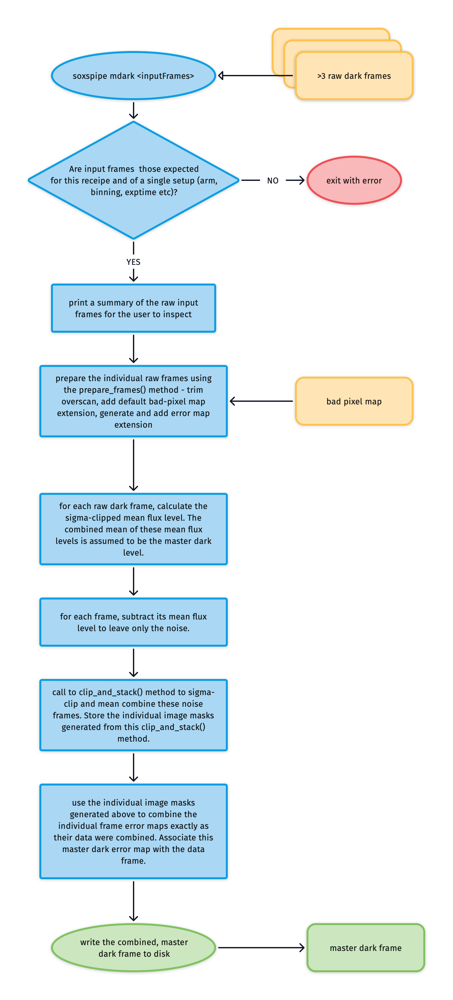

# `soxs_mdark`

Every raw CCD image contains counts resulting from a 'dark current', electrons released due to the thermal effects in the CCD material. For both the UVB-VIS (< 0.00012 $\rm{e^{-}/s/pixel}$) and NIR detectors (< 0.005  $\rm{e^{-}/s/pixel}$), the dark current is almost negligible. Not all pixels will have the same dark current, with some pixels having a higher-than-typical current. These are so-called 'hot-pixels', and these must be identified and recorded (using the [`create_noise_map`](../utils/create_noise_map.md) utility).

The purpose of the [`soxs_mdark`](#soxspipe.recipes.soxs_mdark) recipe is to generate a [master-dark frame](../files/master_dark.md) used to remove flux attributed to the dark current from other frames.

## Input

:::{table} Input files for the soxs_mdark recipe.
:name: soxs_dark_input

| Data Type   | Content                                                      | Related OB                                                   |
| :---------- | :----------------------------------------------------------- | :----------------------------------------------------------- |
| FITS images | raw dark frames (exposures with identical exposure time and detectors readout parameters). | `SOXS_gen_cal_VISDark`, `SOXS_gen_cal_NIRDark`, `SOXS_img_cal_Dark` |

:::

## Parameters

:::{include} parameters/soxs_mdark.md
:::

## Method

The raw dark frames are stacked together (using the [`clip_and_stack`](../utils/clip_and_stack.md) utility) into [master-dark frames](../files/master_dark.md) and, in the process, clipping rogue pixels from the individual raw frames and reducing the read-noise contribution. The algorithm used in the `soxs_mdark` recipe is shown in {numref}`soxs_mdark_diagram`.

:::{figure-md} soxs_mdark_diagram
{width=800px}

The soxs-mdark recipe algorithm.
:::

## Output

:::{table} Output files for the `soxs_mdark` recipe.
:name: soxs_mdark_output

| Label | Content                                                      | Data Type  |
| ----- | :----------------------------------------------------------- | ---------- |
| MDARK | Master dark frame (frame containing typical dark-current flux accumulated over the exposure time of the input frames) | FITS image |

:::

## QC Metrics

:::{table} Quality Control metrics calculated in the `soxs_mdark` recipe. 
:name: soxs_mdark_qc

| Label             | Description            | Unit |
| :---------------- | :--------------------- | ---- |
| `FRAC BAD PIXELS` |                Fraction of bad pixels | -           |
| `MDARK MEDIAN` | Median flux level of master dark | electrons |
| `N BAD PIXELS` |                  Number of bad pixels | -           |
| `N NAN PIXELS` |                  Number of NaN pixels | -           |

:::

## Recipe API

:::{autodoc2-object} soxspipe.recipes.soxs_mdark.soxs_mdark
:::
