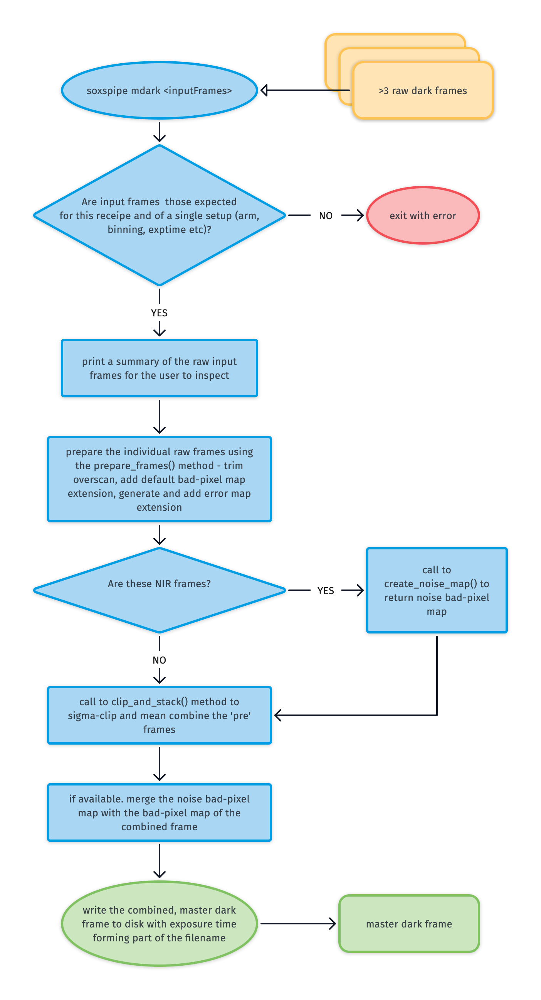

# `soxs_mdark`

Every raw CCD image contains counts resulting from a 'dark current', electrons released due to the thermal effects in the CCD material. For both the UVB-VIS (< 0.00012 e^-^/s/pixel) and NIR detectors (< 0.005 e^-^/s/pixel) the dark-current is almost negligible. Not all pixels will have the same dark-current, some will have a high than typical current. These are so-called 'hot-pixels' and it's important that these are identified and recorded (using the [`create_noise_map`](../utils/create_noise_map.md) utility).

The purpose of the [`soxs_mdark`](../_api/soxspipe.recipes.soxs_mdark.html) recipe is to generate a [master-dark frame](../files/master_dark.md) used to remove flux attributed to the dark-current from other frames.

### Input

<! -- FIND OBs HERE : https://docs.google.com/spreadsheets/d/1-3VXkIWcydvpawwVl_C3pNTU3HgnElJaYFAKow65Fl8/edit#gid=0 -->

| Data Type | Content | Related OB |
|:----|:----|:---|
| FITS images | raw dark frames (exposures with identical exposure time and detectors readout parameters) | `SOXS_gen_cal_VISDark`, `SOXS_gen_cal_NIRDark`, `SOXS_img_cal_Dark` |

### Parameters

| Parameter                | Description                                   | Type  | Entry Point   | Related Util                                   |
| ------------------------ | --------------------------------------------- | ----- | ------------- | ---------------------------------------------- |
| stacked-clipping-sigma | number of σ deviations from the median *pixel* flux beyond which pixel is excluded from stack | float | settings file | [`clip_and_stack`](../utils/clip_and_stack.md) |
| stacked-clipping-iterations | number of σ-clipping iterations to perform before stacking | float | settings file | [`clip_and_stack`](../utils/clip_and_stack.md) |
| clipping-lower-sigma     | number of σ below the median *frame* flux beyond which pixel is added to the bad-pixel mask    | float | settings file | [`clip_and_stack`](../utils/clip_and_stack.md) |
| clipping-upper-sigma     | number of σ above the median *frame* flux beyond which pixel is added to the bad-pixel mask    | float | settings file | [`clip_and_stack`](../utils/clip_and_stack.md) |
| clipping-iteration-count | number of sigma-clipping iterations to perform when added pixels to the bad-pixel mask | int   | settings file | [`clip_and_stack`](../utils/clip_and_stack.md) |

### Method

Stack raw dark-frames together (using the [`clip_and_stack`](../utils/clip_and_stack.md) utility) into [master-dark frames](../files/master_dark.md) and in the process clipping rogue pixels from the individual raw frames and reducing the read-noise contribution.



### Output
 
| Data Type | Content |
|:----|:----|
| master dark frame |  frame containing typical dark-current flux accumulated over the exposure time of the input frames |

### QC Metrics

| Metric  | Description |
| :------------ | :----------- |
| TBC     | ...  |

### Recipe API

```eval_rst
.. autoclass:: soxspipe.recipes.soxs_mdark
    :members:
```
