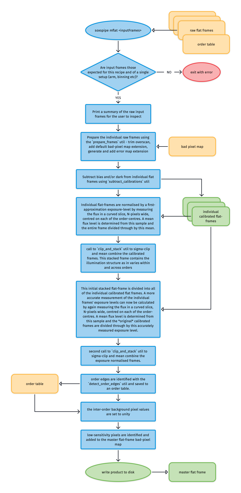
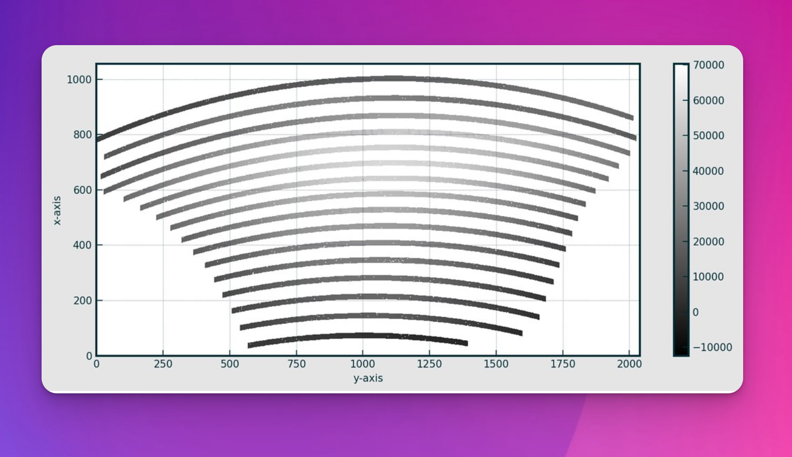
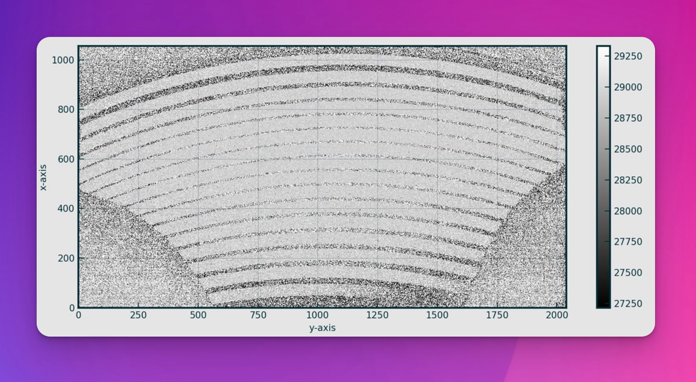
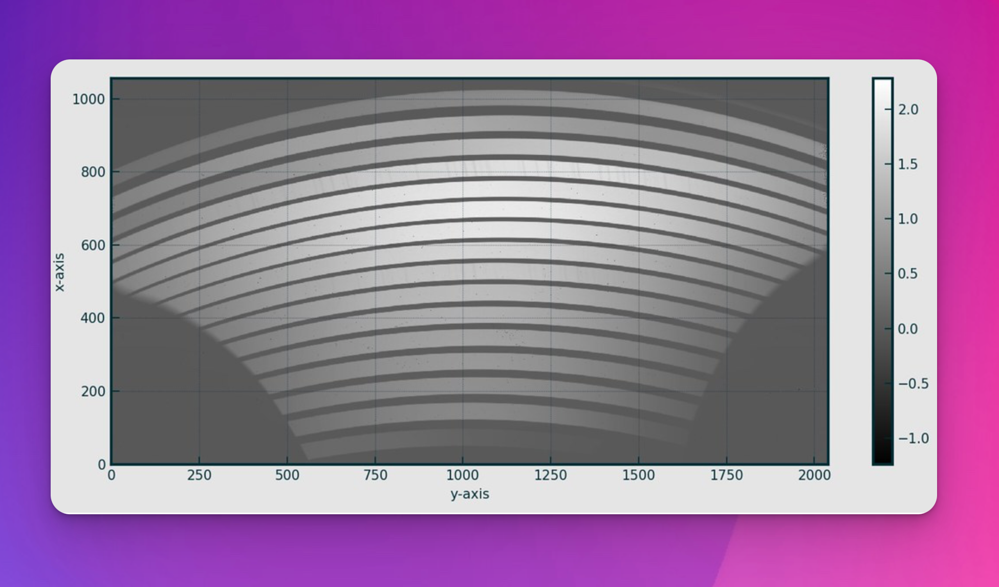
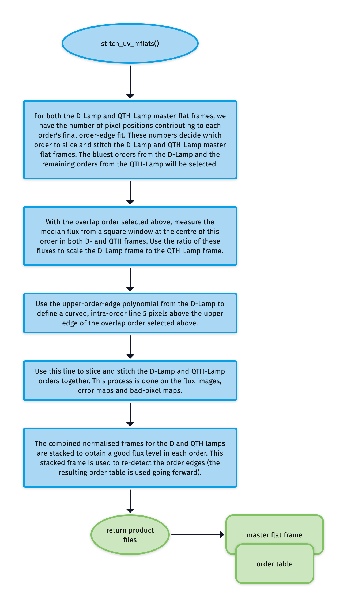
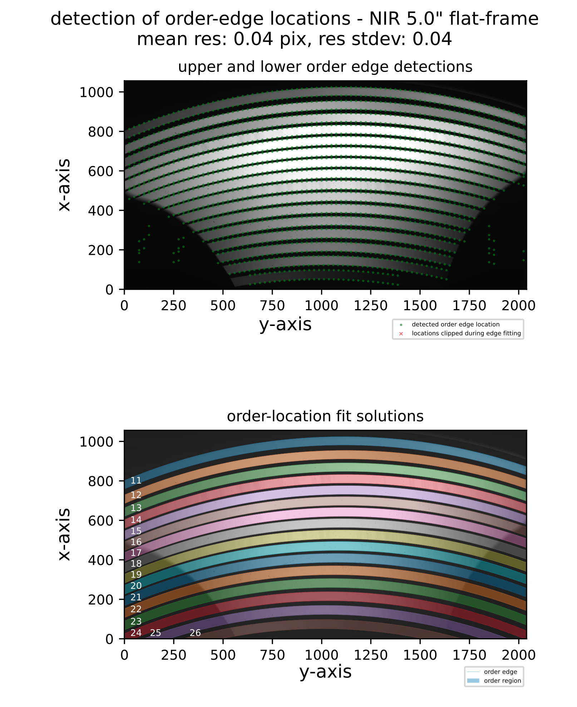

# soxs_mflat

The [`soxs_mflat`](#soxspipe.recipes.soxs_mflat) recipe creates a single normalised master-flat frame used to correct for non-uniformity in response to light across the detector plane. Hot and dead pixels are also detected and added to a bad-pixel mask. Finally, the echelle order edges are detected and fitted with a polynomial model.

Sources of this non-uniformity include:
Varying pixel sensitivities.
Obstructions in the optical path (e.g., dust or pollen grains).
Vignetting at the edges of the detector.
A flat frame is ideally an image taken with uniform illumination across the detector's light-collecting pixels. This evenly exposed image can be used to identify irregularities in the detector's response.

## Input

:::{include} inputs/soxs_mflat.md
:::

## Parameters

:::{include} parameters/soxs_mflat.md
:::

## Method

The algorithm used in the `soxs_mflat` recipe is shown in {numref}`soxs_mflat_diagram`.

:::{figure-md} soxs_mflat_diagram
{width=600px}

The `soxs_mflat` recipe algorithm.
:::

The individual flat field frames have bias and dark signatures removed using the [`detrend`](../utils/detrend.md) utility. Here is an example of one such calibrated flat frame:

### Normalising Exposure Levels in Individual Flat Frames

Once calibrated, exposure levels in the individual flat frames are normalised, as the total illumination varies from frame to frame. The individual frame exposure levels are calculated in two stages.

In the first stage, the mean inner-order pixel value across the frame is used as a first approximation of an individual frame's exposure level. To calculate this mean value, the order locations identify a curved slice N pixels wide centred on each order centre, and bad pixels are masked (see {numref}`soxs_mflat_normalise_1`). The collected inner-order pixel values are then sigma-clipped to exclude outlying values, and a mean value is calculated.

:::{figure-md} soxs_mflat_normalise_1
{width=600px}

The inner regions of the echelle orders are used to calculate a mean exposure level for the individual flats.
:::

In a first attempt to normalise the exposure levels of individual frames, they are divided by their mean inner-order pixel value. These normalised flat frames are combined using the [`clip_and_stack`](../utils/clip_and_stack.md) utility to create a first-pass master-flat frame.

The second stage divides each original dark and bias-subtracted flat frame by this first-pass master flat (see {numref}`soxs_mflat_normalise_2`). This removes the typical cross-plane illumination. So now, the mean inner-order pixel value across the frame will better estimate each frame's intrinsic exposure level.

:::{figure-md} soxs_mflat_normalise_2
{width=600px}

An individual flat frame divided by the first-pass master flat.
:::

On this frame, the mean inner-order pixel value is calculated again, and the original dark and bias-subtracted flat is re-normalised by being divided by this accurate measurement of its intrinsic exposure level.

### Building a Final Master-Flat Frame

These re-normalised flats are then combined for a second time into a master-flat frame.

:::{figure-md} soxs_mflat_master
{width=600px}

A master-flat frame for Xshooter NIR.
:::

Finally, order edges are located with the [`detect_order_edges`](../utils/detect_order_edges.md) utility, and the inter-order area pixel value is set to 1. 

Low-sensitivity pixels are flagged and added to the bad-pixel map, and the final master-flat frame is written to disk.

### UV Master Flat Frame Stitching

As the UV-VIS uses a combination of D-lamp and QTH-lamp flat sets, a further step is required to stitch the best orders from each of these master flats together into a dual-lamp master flat (see {numref}`soxs_mflat_ubv_stitching`).

:::{figure-md} soxs_mflat_ubv_stitching
{width=600px}

The algorithm used to stitch together master flat frames from the UVB D- and QTH lamps to form a single flat frame covering the entire UVB wavelength range.
:::

For both the D-Lamp and QTH-Lamp master flat frames, we have the number of pixel positions that contributed to the final order-edge fit for each order. We use these numbers to decide which orders to slice and stitch from the D-Lamp to the QTH-Lamp master flat frame. 

With a crossover order now selected, the median flux from a square window at the centre of this order in both D- and QTH frames is measured. Using the ratio of these fluxes, the D-Lamp frame is scaled to the QTH-Lamp frame.

From the upper order-edge polynomial for the D-Lamp, we define a curved, intra-order line 5 pixels above the upper edge of the crossover order selected previously. This line is used to slice and stitch the D-Lamp and QTH-Lamp orders together. This process is done on the flux images, error maps and bad-pixel maps. Typically, the bluest orders from the D-Lamp will be selected, with the remaining orders coming from the QTH-Lamp.

Finally, the combined normalised frames for the D and QTH lamps are stacked to obtain a good flux level in each order. This stacked frame is used to re-detect the order edges (the resulting order table is used going forward).

## Output

:::{include} output/soxs_mflat.md
:::

## QC Metrics

:::{figure-md} soxs_mflat_qc
{width=600px}

A QC plot resulting from the `soxs_mflat` recipe (Xshooter NIR). The top panel shows the upper and lower-order edge detections registered in the individual cross-dispersion slices in an Xshooter NIR flat frame. The bottom panel shows the global polynomial fits to the upper and lower-order edges, with the area between the fits filled with different colours to reveal the unique echelle orders across the detector plane.
:::

:::{include} qcs/soxs_mflat.md
:::

## Recipe API

:::{autodoc2-object} soxspipe.recipes.soxs_mflat.soxs_mflat
:::
