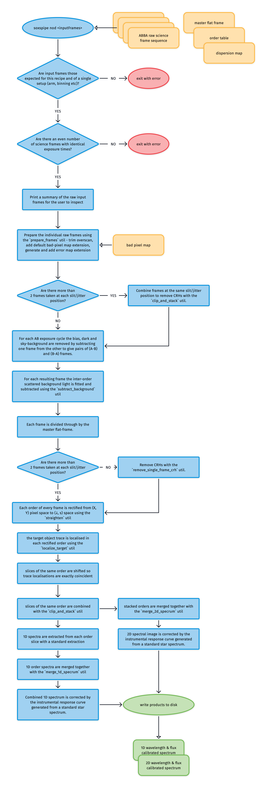

## `soxs_nod_mode` - PLANNED

The purpose of the [`soxs_nod`](../_api/soxspipe.recipes.soxs_nod_mode.html) recipe is to reduced the science frames produced by the NTT and SOXS from a nodding mode observation block.

### Input

<!-- FIND OBs HERE : https://docs.google.com/spreadsheets/d/1-3VXkIWcydvpawwVl_C3pNTU3HgnElJaYFAKow65Fl8/edit#gid=0 -->

| Data Type | Content | Related OB |
|:----|:----|:---|
| | |

### Parameters

| Parameter                | Description                                   | Type  | Entry Point   | Related Util                                   |
| ------------------------ | --------------------------------------------- | ----- | ------------- | ---------------------------------------------- |
|   |   |   |   |

### Method

<!-- METHOD TEXT HERE, FOLLOWED BY WORKFLOW DIAGRAM -->



### Output
 
| Data Type | Content |
|:----|:----|
| |

### QC Metrics

| Metric  | Description |
| :------------ | :----------- |
| TBC     | ...  |

### Recipe API

<!-- ```eval_rst
.. autoclass:: soxspipe.recipes.soxs_nod_mode
    :members:
```
 -->
