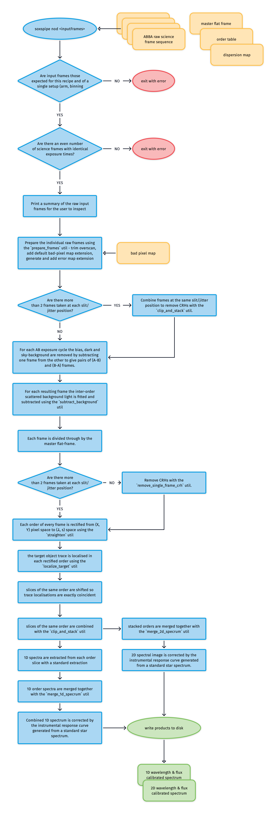

# soxs_nod_std

:::{include} ./descriptions/soxs_nod_std.inc
:::

## Input

:::{include} ./inputs/soxs_nod_std.inc
:::

:::{include} ./static_files/soxs_nod_std.inc
:::

## Parameters

:::{include} parameters/soxs_nod_std.inc
:::

## Method

The algorithm used in the `soxs_nod` and `soxs_nod_std` recipe is shown in {numref}`soxs_nod_diagram`.

:::{figure-md} soxs_nod_diagram
{width=600px}

The `soxs_nod` and `soxs_nod_std` recipes reduced SOXS data acquired in nodding mode with one or multiple ABBA (jitter offsets) sequences. 
:::

See [`soxs_nod`](./soxs_nod.md) for more details.

## Output

:::{include} output/soxs_nod_std.inc
:::

:::{figure-md} soxs_nod_qc

A QC plot resulting from the `soxs_nod` recipe. This is a SOXS VIS wavelength and flux calibrated spectrum of the standard star CD-325613. The top- and middle-panels show the flux and wavelength calibrated spectrum, the top in linear-flux and the middle in log-flux scale. The bottom panel shows the signal-to-noise ratio across the entire wavelength range covered by the spectrum.

:::

:::{figure-md} response_curve_util

The output of the `reponse_function` utility (used by nodding and stare recipes) used in the reduction of spectroscopic standard star spectra. The third panel shows th fittted response curve, and the final panel shows the overall efficiency of the instrument across the entire wavelength range of the spectrograph arm. 

:::

## QC Metrics

:::{include} qcs/soxs_nod_std.inc
:::

## Recipe API

:::{autodoc2-object} soxspipe.recipes.soxs_nod.soxs_nod
:::
