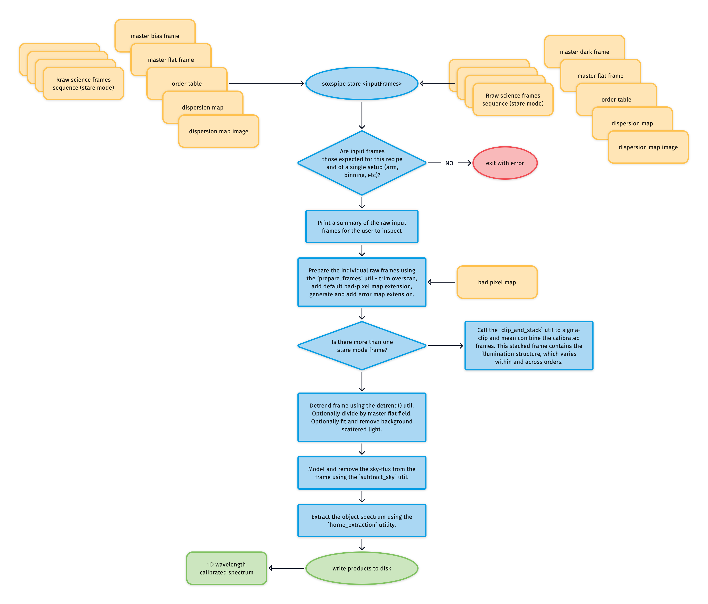
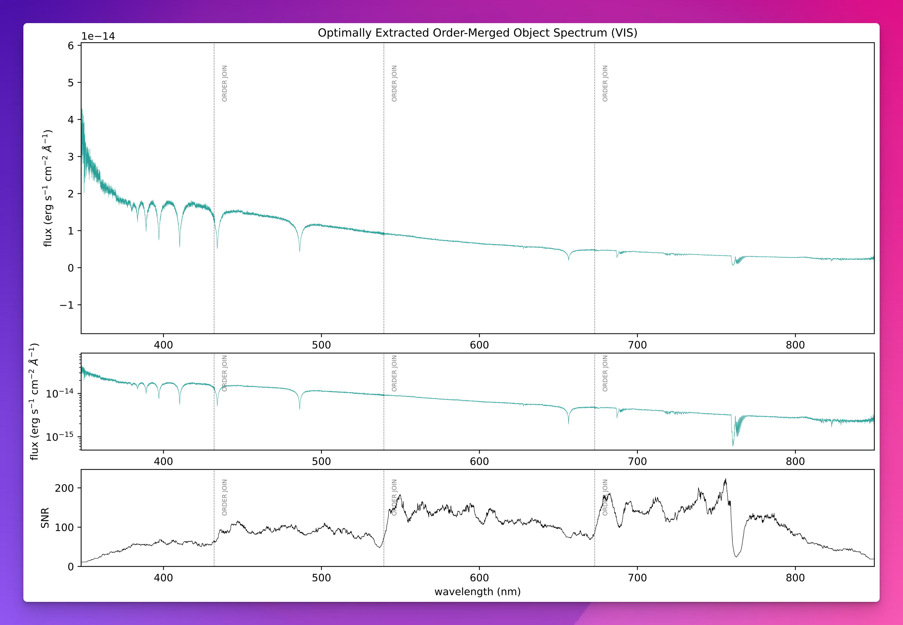

# soxs_stare_std

:::{include} ./descriptions/soxs_stare_std.inc
:::

## Input

:::{include} ./inputs/soxs_stare_std.inc
:::

:::{include} ./static_files/soxs_stare_std.inc
:::

## Parameters

:::{include} parameters/soxs_stare_std.inc
:::

## Method

The algorithm used in the `soxs_stare` and `soxs_stare_std` recipes is shown in {numref}`soxs_stare_diagram`.

:::{figure-md} soxs_stare_diagram
{width=600px}

The `soxs_stare`/`soxs_stare_std` recipe algorithm. At the top of the diagram, NIR input data is found on the right and VIS on the left. 
:::

See [`soxs_stare`](./soxs_stare.md) for more details.

## Output

:::{include} output/soxs_stare_std.inc
:::

## QC Metrics

:::{include} qcs/soxs_stare_std.inc
:::

:::{figure-md} soxs_stare_std_qc

A QC plot resulting from the `soxs_nod_std` recipe (but very similar to the same QC plot generated by `soxs_stare_std`). This is a SOXS VIS wavelength and flux calibrated spectrum of the standard star CD-325613. The top- and middle-panels show the flux and wavelength calibrated spectrum, the top in linear-flux and the middle in log-flux scale. The bottom panel shows the signal-to-noise ratio across the entire wavelength range covered by the spectrum.

:::

:::{figure-md} response_curve_util

The output of the `reponse_function` utility (used by nodding and stare recipes) used in the reduction of spectroscopic standard star spectra. The third panel shows the fittted response curve, and the final panel shows the overall efficiency of the instrument across the entire wavelength range of the spectrograph arm. 

:::

## Recipe API

:::{autodoc2-object} soxspipe.recipes.soxs_stare.soxs_stare
:::
