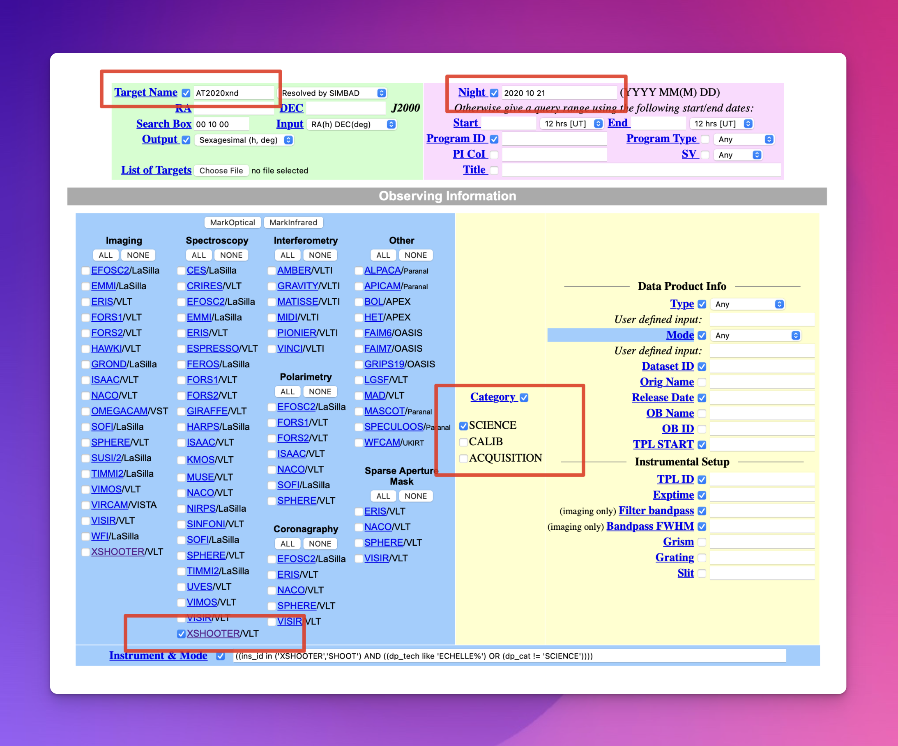

# Collecting Data

Before you can reduce SOXS or XShooter data, you will first need to download the data from the [ESO Science Archive Facility](https://archive.eso.org/eso/eso_archive_main.html) (SAF). As a first step, navigate to the [SAF query interface](https://archive.eso.org/eso/eso_archive_main.html) and fill in the details of the object data set you are interested in downloading. Add the target's name and, optionally, the night the data was acquired. Select XSHOOTER or SOXS under the Spectroscopy column (and Imaging if required) and check 'Science' under the Category section (see {numref}`saf_query_interface`). Now, click the green 'Search' button.

:::{figure-md} saf_query_interface

The Query Interface of the ESO Science Archive Facility.  
:::

Now, click on the 'MarkAll' button and then 'Request marked datasets' (see {numref}`request_data`).

:::{figure-md} request_data

Mark all of the data and request to download.
:::

Collecting the associated raw calibration frames with the raw science frames is essential. Otherwise, the pipeline will not be able to reduce your data. To do this, click the 'Run association' button beside the 'Associated raw calibrations' checkbox (shown in {numref}`associated_calibration_data`). Once the association is completed, the 'Associated raw calibrations' checkbox should be checked.

:::{figure-md} associated_calibration_data

Download the associated calibration data alongside the science data.
:::

Finally, click the 'Download ZIP file' button.

:::{figure-md} download_data_button

Download the data by clicking the 'Download ZIP file' button.
:::

The data will be collected in an 'archive.zip' archive, which can be uncompressed with the 'unzip' terminal command or typically by double-clicking the archive in your machine's file browser.
