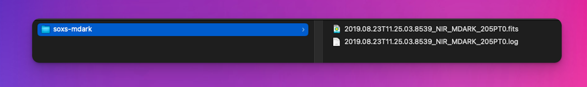
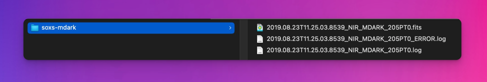

# Logging

When running a recipe, `soxspipe` writes informative logs to the terminal (stdout), allowing the user to keep track of the reduction progress in real-time. For provenance, this information is also written to a log file adjacent to the recipe's product file(s).


:::{figure-md} log_file


A log file for each recipe is written beside the recipe product.
:::

If the recipe fails, a separate error log is written to the directory the product file should have been written to had the recipe succeeded. Error logs are named with a *"_ERROR.log" suffix.

:::{figure-md} error_log_file


An error log is written to the recipe's product directory if the recipe fails to complete.
:::

Here is an example log file from one of the simpler recipes (`mdark`):

```text
# VERIFYING INPUT FRAMES
# VERIFYING INPUT FRAMES - ALL GOOD

# PREPARING 3 RAW FRAMES - TRIMMING OVERSCAN, CONVERTING TO ELECTRON COUNTS, GENERATING UNCERTAINTY MAPS AND APPENDING DEFAULT BAD-PIXEL MASK
# PREPARED FRAMES - SUMMARY
               filename                INSTRUME    MJD-OBS     TYPE  CATG  TECH ARM EXPTIME  SLIT LAMP
-------------------------------------- -------- -------------- ---- ----- ----- --- ------- ----- ----
XSHOO.2020-10-15T11:46:37.097_pre.fits XSHOOTER 59137.49070714 DARK CALIB IMAGE NIR    10.0 Blind   --
XSHOO.2020-10-15T11:46:52.655_pre.fits XSHOOTER 59137.49088721 DARK CALIB IMAGE NIR    10.0 Blind   --
XSHOO.2020-10-15T11:47:10.217_pre.fits XSHOOTER 59137.49109048 DARK CALIB IMAGE NIR    10.0 Blind   --


# MEAN COMBINING 3 NIR CALIB IMAGE DARK FRAMES
	The basic bad-pixel mask for the NIR detector DARK frames contains 12349 pixels (0.57% of all pixels)
	0 new pixels made it into the combined bad-pixel map (bad pixels now account for 0.57% of all pixels)

# SOXS-MDARK QC METRICS
+-----------------+--------------+-----------+---------------------------------------+
|         qc_name |     qc_value |   qc_unit |                            qc_comment |
|-----------------+--------------+-----------+---------------------------------------|
| FRAC BAD PIXELS |     0.005732 |           |                Fraction of bad pixels |
|    MDARK MEDIAN |   280.897    | electrons | [e-] Median flux level of master dark |
|    N BAD PIXELS | 12349        |           |                  Number of bad pixels |
|    N NAN PIXELS |     0        |           |                  Number of NaN pixels |
|    RON DETECTOR |    14.9194   | electrons |               [e-] RON in single DARK |
+-----------------+--------------+-----------+---------------------------------------+

# SOXS-MDARK RECIPE PRODUCTS & QC OUTPUTS
+-----------------+--------------------------------------------------------+-------------+--------------------------+---------+-----------------------+
|   product_label |                                              file_name |   file_type |             obs_date_utc |   label |          product_desc |
|-----------------+--------------------------------------------------------+-------------+--------------------------+---------+-----------------------|
|           MDARK | 2020.10.15T11.46.37.0966_NIR_MDARK_10.0S_XSHOOTER.fits |        FITS | 2020-10-15T11:46:37.0966 |    PROD | NIR Master dark frame |
+-----------------+--------------------------------------------------------+-------------+--------------------------+---------+-----------------------+

Recipe Command: soxspipe mdark sof/2020.10.15T11.46.37.0966_NIR_MDARK_10.0S_XSHOOTER.sof -s ./sessions/base/soxspipe.yaml 
Recipe Run Time: 1s
```

Informative results from each stage of the recipe's reduction tasks are written, including a list describing the input files, a table of QC results and a table of the data-reduction products and QC plots generated. At the end of the log file, the user will find the command required to rerun the recipes and a report on the time it took for the recipe to complete.

