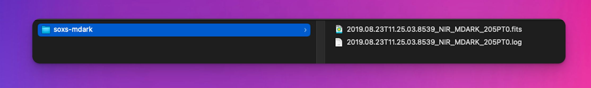
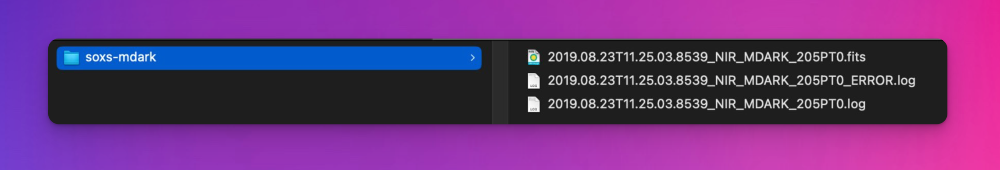

# Logging

When running a recipe, `soxspipe` writes informative logs to the terminal (stdout), allowing the user to keep track of the reduction progress in real-time. For provenance, this information is also written to a log file adjacent to the recipe's product file(s).


:::{figure-md} log_file


A log file for each recipe is written beside the recipe product.
:::

If the recipe fails, a separate error log is written to the directory the product file should have been written to had the recipe succeeded. Error logs are named with a *"_ERROR.log" suffix.

:::{figure-md} error_log_file


An error log is written to the recipe's product directory if the recipe fails to complete.
:::

Here is an example log file from one of the simpler recipes (`mdark`):

```text
Recipe Command: soxspipe mdark sof/20260111T083044_NIR_3_MDARK_10_0S_SOXS.sof -s ./soxspipe.yaml
# VERIFYING INPUT FRAMES

	Gain is being read from the detector parameter file (not the FITS header)

# VERIFYING INPUT FRAMES - ALL GOOD

# PREPARING 5 RAW FRAMES - TRIMMING OVERSCAN, CONVERTING TO ELECTRON COUNTS, GENERATING UNCERTAINTY MAPS AND APPENDING DEFAULT BAD-PIXEL MASK
# PREPARED FRAMES - SUMMARY
               filename               INSTRUME    MJD-OBS     TYPE  CATG  TECH ARM EXPTIME ESO PRO TYPE ESO PRO CATG ESO PRO TECH  SLIT LAMP
------------------------------------- -------- -------------- ---- ----- ----- --- ------- ------------ ------------ ------------ ----- ----
SOXS.2026-01-11T08:30:44.542_pre.fits     SOXS  61051.3546822 DARK CALIB IMAGE NIR    10.0           --           --           -- BLANK   --
SOXS.2026-01-11T08:31:03.437_pre.fits     SOXS 61051.35490089 DARK CALIB IMAGE NIR    10.0           --           --           -- BLANK   --
SOXS.2026-01-11T08:31:23.438_pre.fits     SOXS 61051.35513238 DARK CALIB IMAGE NIR    10.0           --           --           -- BLANK   --
SOXS.2026-01-11T08:31:43.438_pre.fits     SOXS 61051.35536387 DARK CALIB IMAGE NIR    10.0           --           --           -- BLANK   --
SOXS.2026-01-11T08:32:03.443_pre.fits     SOXS 61051.35559541 DARK CALIB IMAGE NIR    10.0           --           --           -- BLANK   --


# MEAN COMBINING 5 NIR CALIB IMAGE DARK FRAMES
	The basic bad-pixel mask for the NIR detector DARK frames contains 0 pixels (0.0% of all pixels)
	0 new pixels made it into the combined bad-pixel map (bad pixels now account for 0.00% of all pixels)

# SOXS-MDARK QC METRICS
+---------------+------------+-----------+---------------------------------------+-----------+
|       qc_name |   qc_value |   qc_unit |                            qc_comment |   qc_flag |
|---------------+------------+-----------+---------------------------------------+-----------|
|    CPATH TEMP |     16     |   celsius |               [C] temp of common path |      pass |
| DETECTOR TEMP |     45     |    kelvin |                  [K] temp of detector |      pass |
|   HOTPIX FRAC |      0     |           |                Fraction of hot pixels |      pass |
|    HOTPIX NUM |      0     |           |                  Number of hot pixels |      pass |
|  MDARK MEDIAN |     -1.179 | electrons | [e-] Median flux level of master dark |      pass |
|       RAW RON |     14.858 | electrons |               [e-] RON in single DARK |      pass |
+---------------+------------+-----------+---------------------------------------+-----------+

# SOXS-MDARK RECIPE PRODUCTS & QC OUTPUTS
+-----------------+---------------------------------------------+-------------+--------------------------+---------+-----------------------+
|   product_label |                                   file_name |   file_type |             obs_date_utc |   label |          product_desc |
|-----------------+---------------------------------------------+-------------+--------------------------+---------+-----------------------|
|           MDARK | 20260111T083044_NIR_3_MDARK_10_0S_SOXS.fits |        FITS | 2026-01-11T08:30:44.5420 |    PROD | NIR Master dark frame |
+-----------------+---------------------------------------------+-------------+--------------------------+---------+-----------------------+
```

Informative results from each stage of the recipe's reduction tasks are written, including a list describing the input files, a table of QC results and a table of the data-reduction products and QC plots generated. At the end of the log file, the user will find the command required to rerun the recipes and a report on the time it took for the recipe to complete.

