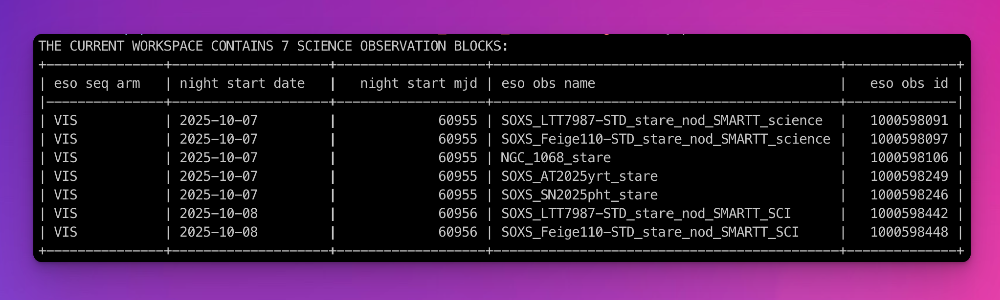
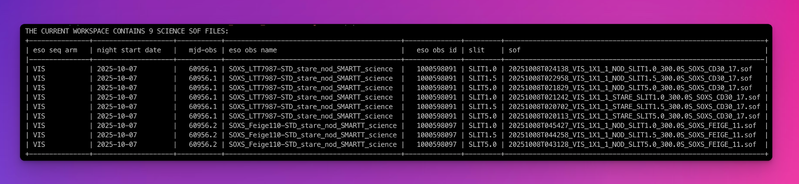

# Preparing a Data-Reduction Workspace

A 'workspace' is simply a directory you create and designate as the location on your machine where you will reduce your data. It is advisable to have multiple workspaces (folders) for multiple datasets. 

First, create your workspace (you can call it whatever you want):

```bash
cd ~/
mkdir soxs-workspace-one
cd soxs-workspace-one
```

Now download/move all of the SOXS or Xshooter raw data from your data set into the root of this workspace. There is no need for nested folders; just fill the directory with FITS files.

 `soxspipe` has a built-in [data organiser](../data_organiser_and_reducer/data_organiser.md) that does the heavy lifting of sorting and preparing your raw data for data reduction. So to prepare your workspace, change into the workspace directory and run the `soxspipe prep` command:

```bash
cd ~/soxs-workspace-one
soxspipe prep .
```

Once the workspace has been prepared, you should find it contains the following files and folders:

- `misc/`: a lost-and-found archive of non-fits files
- `raw/`: all raw frames to be reduced
- `sessions/`: directory of data-reduction sessions
- `sof/`: the set-of-files (sof) files required for each reduction step
- `soxspipe.db`: an SQLite database needed by the data-organiser; please do not delete
- `soxspipe.yaml`: file containing the default settings for each pipeline recipe

Your workspace is now prepared, and you are now ready to reduce your data.

:::{include} sessions.inc
:::

## Listing The Content of a Workspace

### List OBs

The `soxspipe list` commands can be used to list the science content of the workspace. To list all of the science OBs contained within a workspace, run the command `soxspipe list obs <workspaceDirectory>`. 

:::{figure-md} soxspipe_list_obs


Listing the OBs contained within a workspace with the `soxspipe list obs .` command.
:::

### List SOF files

An OB can contain multiple telescope-instrument setups (slit-widths, observing modes etc), but each individual setup will be listed in a unique SOF file. To list all of the science set-of-files (SOF) files contained within a workspace, run the command `soxspipe list sof <workspaceDirectory>`. 

:::{figure-md} soxspipe_list_obs


Listing the science SOF files contained within a workspace with the `soxspipe list sof .` command.
:::
