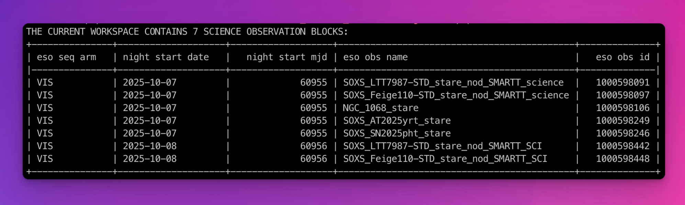

# Preparing a Data-Reduction Workspace

A 'workspace' is simply a directory you create and designate as the location on your machine where you will reduce your data. It is advisable to have multiple workspaces (folders) for multiple datasets. 

First, create your workspace (you can call it whatever you want):

```bash
cd ~/
mkdir soxs-workspace-one
cd soxs-workspace-one
```

Now download/move all of the SOXS<!--or Xshooter--> raw data from your data set into the root of this workspace. There is no need for nested folders; just fill the directory with FITS files.

 `soxspipe` has a built-in [data organiser](../data_organiser_and_reducer/data_organiser.md) that does the heavy lifting of sorting and preparing your raw data for data reduction. So to prepare your workspace, change into the workspace directory and run the `soxspipe prep` command:

```bash
cd ~/soxs-workspace-one
soxspipe prep .
```

Once the workspace has been prepared, you should find it contains the following files and folders:

- `misc/`: a lost-and-found archive of non-fits files
- `qc/`: a directory to host the quality control data and plots
- `raw/`: all raw frames to be reduced
- `reduced/`: a directory to host the reduced data
- `sessions/`: directory of data-reduction sessions
- `sof/`: the set-of-files (sof) files required for each reduction step
- `soxspipe.db`: an SQLite database needed by the data-organiser; please do not delete
- `soxspipe.yaml`: file containing the default settings for each pipeline recipe

Your workspace is now prepared, and you are now ready to reduce your data.

:::{include} sessions.inc
:::

## Listing The Content of a Workspace

### List OBs

The `soxspipe list` commands can be used to list the science content of the workspace. To list all of the science OBs contained within a workspace, run the command `soxspipe list obs <workspaceDirectory>`. 

:::{figure-md} soxspipe_list_obs


Listing the OBs contained within a workspace with the `soxspipe list obs .` command.
:::

### List SOF files

An OB can contain multiple telescope-instrument setups (slit-widths, observing modes etc), but each individual setup will be listed in a unique SOF file. To list all of the science set-of-files (SOF) files contained within a workspace, run the command `soxspipe list sof <workspaceDirectory>`. 

:::{figure-md} soxspipe_list_obs


Listing the science SOF files contained within a workspace with the `soxspipe list sof .` command.
:::

## Refresh a workspace

Use `soxspipe prep --refresh` to rebuild the workspace database from the raw frames and do a complete prepare. This section is for people who run `soxspipe prep` on an existing workspace.

The same rebuild starts by itself when `soxspipe prep` finds a workspace database that will not open.

### What is kept

Before the database is deleted, `soxspipe` saves it to the `backups/` directory in the workspace root. If the database cannot be saved, `soxspipe prep` leaves it in place, rebuilds nothing, and exits with status 1.

After the rebuild, `soxspipe` restores two things from the backup:

- The `quality_control` rows.
- The pass/fail status of each SOF (set-of-files) file, for every session directory in the workspace, not only the current session.

The QC acceptable-range checks run again after each restore. A restored `fail` status changes to `pass` if the QC rows for that product are now in range.

### When a status is restored

A status is restored only when both of these are true:

- The SOF name exists in the rebuilt database.
- The SOF holds the same set of files before and after the rebuild.

If the set of files is different, the status is not restored and the SOF is queued for reduction again. A SOF that exists only in the backup is dropped. The backup file keeps its status.

### Summary lines

`soxspipe prep` prints one line for each session. For example:

```text
session 'science': 212 statuses restored, 2 changed (frames differ, requeued), 3 dropped (product no longer exists)
```

When the changed count or the dropped count is more than zero, the line ends with `; the previous statuses are kept in <backup path>`.

### Limits

- The restore is best effort. If `soxspipe` cannot read the backup, it prints a warning that names the backup file, leaves the status columns empty, and continues. It does not ask you anything.
- For a session that is not the current session, `soxspipe` compares the SOF against the SOF map that it rebuilt for the current session.
- The `error_message` column is not restored.
