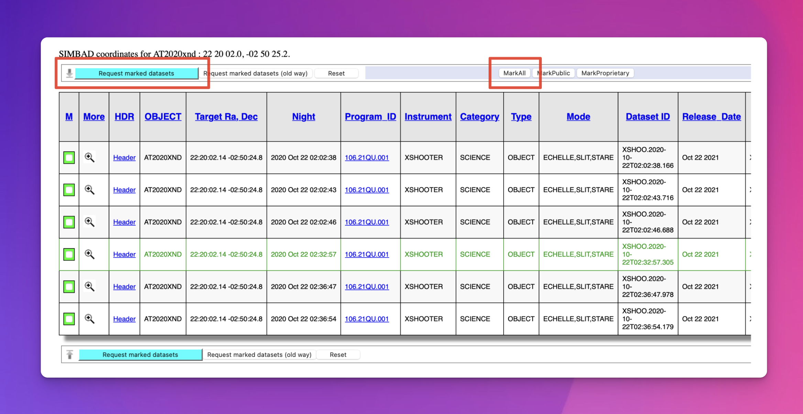
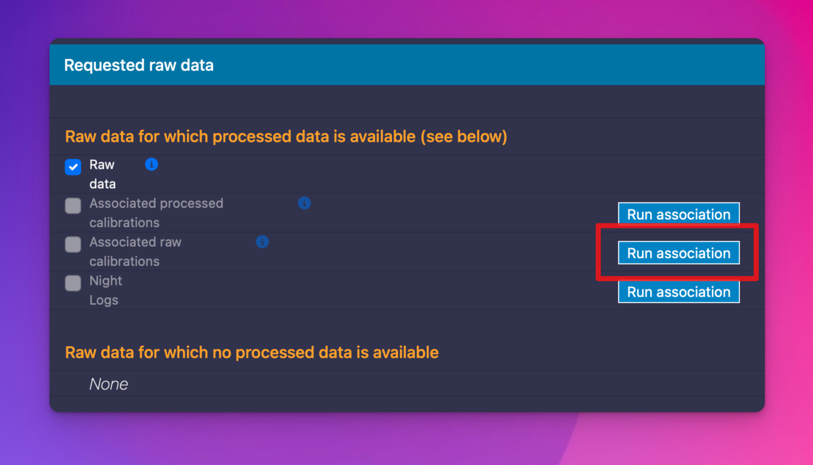
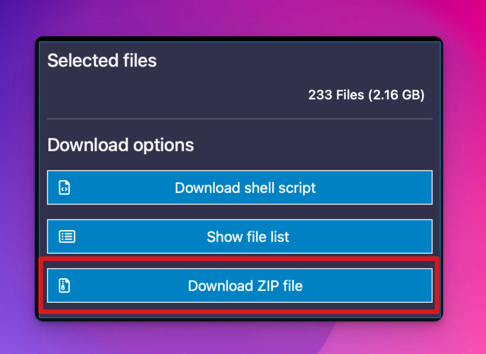

# Quickstart Guide

:::{warning}
This quickstart guide is subject to (much) change during the pipeline's development. New features and ways of operating the pipeline are still being added. Current data taken in stare mode can be reduced to the point of sky subtraction. 
:::

## Install

The best way to install soxspipe is to use `conda` and install the package in its own isolated environment (preferably using [Miniforge](https://github.com/conda-forge/miniforge); a minimal installation for the conda package and environment manager), as shown here:

``` bash
conda create -n soxspipe python=3.12 soxspipe -c conda-forge
conda activate soxspipe
```

If you have previously installed soxspipe, a warning will be issued stating that a conda environment already exists; select `y` when asked to remove the existing environment. This has proven to be the cleanest way to upgrade soxspipe.

To check if the installation was successful, run `soxspipe -v`. This should return the installation's version number.

Please refer to the [installation section](installation.md) for alternative methods of installing `soxspipe`.

## Demo Data

The demo XShooter data for this quickstart guide is of AT2020xnd, a super-luminous supernova taken in stare mode, and HD 168076, a bright O-type star taken in nodding mode. To download the data from the [ESO Science Archive Facility](http://archive.eso.org/eso/eso_archive_main.html) click on the these [AT2020xnd](http://archive.eso.org/wdb/wdb/eso/eso_archive_main/query?wdbo=html%2fdisplay&max_rows_returned=20000&instrument=&tab_object=on&target=AT2020xnd&resolver=simbad&ra=&dec=&box=00%2010%2000&degrees_or_hours=hours&tab_target_coord=on&format=SexaHour&wdb_input_file=&tab_night=on&night=2020%2010%2021&stime=&starttime=12&etime=&endtime=12&tab_prog_id=on&prog_id=&gto=&pi_coi=&obs_mode=&title=&spectrum[]=SHOOT&tab_dp_cat=on&dp_cat=SCIENCE&tab_dp_type=on&dp_type=&dp_type_user=&tab_dp_tech=on&dp_tech=&dp_tech_user=&tab_dp_id=on&dp_id=&origfile=&tab_rel_date=on&rel_date=&obs_name=&ob_id=&tab_tpl_start=on&tpl_start=&tab_tpl_id=on&tpl_id=&tab_exptime=on&exptime=&tab_filter_path=on&filter_path=&tab_wavelength_input=on&wavelength_input=&tab_fwhm_input=on&fwhm_input=&gris_path=&grat_path=&slit_path=&tab_instrument=on&add=((ins_id%20in%20(%27XSHOOTER%27,%27SHOOT%27)%20AND%20((dp_tech%20like%20%27ECHELLE%25%27)%20OR%20(dp_cat%20!=%20%27SCIENCE%27))))&tab_tel_airm_start=on&tab_stat_instrument=on&tab_ambient=on&tab_stat_exptime=on&tab_HDR=on&tab_mjd_obs=on&aladin_colour=aladin_instrument&tab_stat_plot=on&order=&) and [HD 168076](http://archive.eso.org/wdb/wdb/eso/eso_archive_main/query?wdbo=html%2fdisplay&max_rows_returned=20000&instrument=&tab_object=on&target=HD168076&resolver=simbad&ra=&dec=&box=00%2010%2000&degrees_or_hours=hours&tab_target_coord=on&format=SexaHour&wdb_input_file=&night=&stime=&starttime=12&etime=&endtime=12&tab_prog_id=on&prog_id=&gto=&pi_coi=&obs_mode=&title=&spectrum[]=SHOOT&tab_dp_cat=on&dp_cat=SCIENCE&tab_dp_type=on&dp_type=&dp_type_user=&tab_dp_tech=on&dp_tech=&dp_tech_user=&tab_dp_id=on&dp_id=&origfile=&tab_rel_date=on&rel_date=&obs_name=&ob_id=&tab_tpl_start=on&tpl_start=&tab_tpl_id=on&tpl_id=&tab_exptime=on&exptime=&tab_filter_path=on&filter_path=&tab_wavelength_input=on&wavelength_input=&tab_fwhm_input=on&fwhm_input=&gris_path=&grat_path=&slit_path=&tab_instrument=on&add=((ins_id%20in%20(%27XSHOOTER%27,%27SHOOT%27)%20AND%20((dp_tech%20like%20%27ECHELLE%25%27)%20OR%20(dp_cat%20!=%20%27SCIENCE%27))))&tab_tel_airm_start=on&tab_stat_instrument=on&tab_ambient=on&tab_stat_exptime=on&tab_HDR=on&tab_mjd_obs=on&aladin_colour=aladin_instrument&tab_stat_plot=on&order=&) links. 

For each dataset, click on the 'MarkAll' button and then 'Request marked datasets' (see {numref}`request_data`).

:::{figure-md} request_data


Mark all of the data and request to download.
:::


Collecting the associated raw calibration frames with the raw science frames is essential. Otherwise, the pipeline will not be able to reduce your data. To do this, click the 'Run association' button beside the 'Associated raw calibrations' checkbox (shown in {numref}`associated_calibration_data`). Once the association is completed, the 'Associated raw calibrations' checkbox should be checked.

:::{figure-md} associated_calibration_data


Download the associated calibration data alongside the science data.
:::

Finally, click the 'Download ZIP file' button.

:::{figure-md} download_data_button


Download the data by clicking the 'Download ZIP file' button.
:::

## Preparing the Data-Reduction Workspace

Now you have a sample data set to work with, it is time to prepare the `soxspipe-quickstart-demo` workspace. Start by creating a `soxspipe-quickstart-demo` folder somewhere appropriate on your machine (like your Desktop or home directory).

```bash
mkdir soxspipe-quickstart-demo
```

Next, locate the data you just downloaded from the ESO SAF (typically this will be in an 'archive.zip' file), unzip it, and move it to the `soxspipe-quickstart-demo` workspace.

Now, change into the `soxspipe-quickstart-demo` directory and run the `soxspipe prep` command:

```bash
cd soxspipe-quickstart-demo
soxspipe prep .
```

Once the workspace has been prepared, you should find it contains the following files and folders:

- `misc/`: a lost-and-found archive of non-fits files
- `raw/`: all raw frames to be reduced
- `sessions/`: directory of data-reduction sessions
- `sof/`: the set-of-files (sof) files required for each reduction step
- `soxspipe.db`: an SQLite database needed by the data organiser; please do not delete
- `soxspipe.yaml`: a file containing the default settings for each pipeline recipe

soxspipe reduces data within a [`reduction session`](./sessions.md), and an initial `base` session is automatically created when running the `prep` command. For a more detailed guide to preparing a workspace, please refer to the [Preparing a Data-Reduction Workspace](preparing_a_workspace.md) section.

## Reduce the Data

In most use cases, you will want to reduce all of the raw frames contained within your workspace. To do this, run the command:

```bash
soxspipe reduce all .
```

The `reduce` command stops when all data within the workspace has been reduced. For a more in-depth guide to using the reduce command, please refer to the [Reducing Data](reductions/index.md) section.
