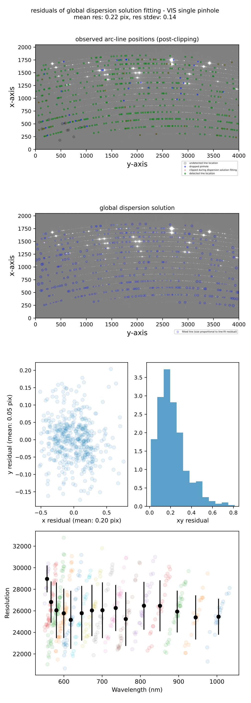

## soxs_disp_solution

The [`soxs_disp_solution`](../../../recipes/soxs_disp_solution.md) recipe can be run with the following convention:

```bash
soxspipe [-Vx] disp_sol <inputFrames> [-o <outputDirectory> -s <pathToSettingsFile> --poly=<od>]
```

To rerun a previously executed `soxs_disp_solution` recipe, you can find the execution command at the end of the [recipe log file](../../logging.md) (found in the workspace `products/soxs_disp_solution` directory). Use the `-x` flag to overwrite the product files if they already exist. For example, from the root of your workspace, you would run a command like:

```bash
soxspipe disp_sol sof/2019.10.31T09.56.05.151_UVB_1X1_FAST_DISP_SOL_THAR_40.0S_XSHOOTER.sof -s ./sessions/base/soxspipe.yaml  -x
```

To adjust the default settings for the `soxs_disp_solution` recipe, open the `soxspipe.yaml` file referenced in the command above in a text editor, navigate to the `soxs_disp_solution` dictionary, save the file and rerun the recipe command. The settings' descriptions can be found in {numref}`soxs_disp_solution_parameters`.

:::{include} ../../../recipes/parameters/soxs_disp_solution.md
:::

Product files are written in the `products/soxs_disp_solution`, and QC plots are in the `qc/soxs_disp_solution` workspace directory. A report of the product files, QC plots and metrics is also printed to the terminal. The QC metrics calculated for `soxs_disp_solution` are found in {numref}`soxs_disp_solution_qc` and a typical QC plot in {numref}`soxs_disp_solution_qc_fig`.

:::{include} ../../../recipes/qcs/soxs_disp_solution.md
:::

:::{figure-md} soxs_disp_solution_qc_fig
{width=601px}

A QC plot resulting from the `soxs_disp_solution` recipe as run on an Xshooter VIS single pinhole arc lamp frame. A 'good' dispersion solution will have sub-pixel residuals (mean residuals $<$ 0.5 pixels). The top panel shows an Xshooter VIS arc-lamp frame, taken with a single pinhole mask. The green circles represent arc lines detected in the image, and the blue circles and red crosses were detected but dropped due to poor DAOStarFinder fitting or clipped during the polynomial fitting, respectively. The grey circles represent arc lines reported in the static calibration table that failed to be detected on the image.  The second panel shows the same arc-lamp frame with the dispersion solution overlaid at the pixel locations modelled for the original lines in the line list. The third panel shows the residuals of the dispersion solution fit, and the final panel shows the resolution measured for each line (as projected through the pinhole mask) with different colours for each echelle order and the mean order resolution in black.

:::
