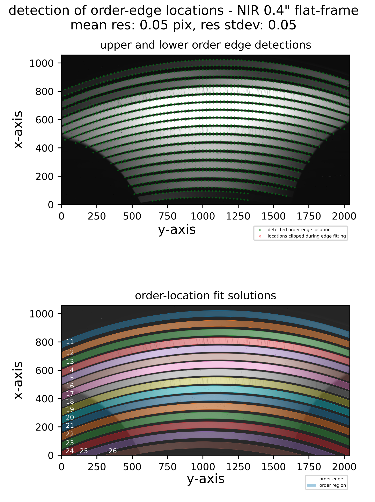

## soxs_mflat

:::{include} ../../../recipes/descriptions/soxs_mflat.inc
:::

### Usage

:::{include} ../../../recipes/cl_usage/soxs_mflat.inc
:::

### Parameters

:::{include} ../../../recipes/parameters/soxs_mflat.inc
:::

### Input

:::{include} ../../../recipes/inputs/soxs_mflat.inc
:::

### Output

:::{include} ../../../recipes/output/soxs_mflat.inc
:::

### QC Metrics

:::{include} ../../../recipes/qcs/soxs_mflat.inc
:::

:::{figure-md} soxs_mflat_qc
{width=600px}

A QC plot resulting from the `soxs_mflat` recipe (Xshooter NIR). The top panel shows the upper and lower-order edge detections registered in the individual cross-dispersion slices in an Xshooter NIR flat frame. The bottom panel shows the global polynomial fits to the upper and lower-order edges, with the area between the fits filled with different colours to reveal the unique echelle orders across the detector plane.
:::

