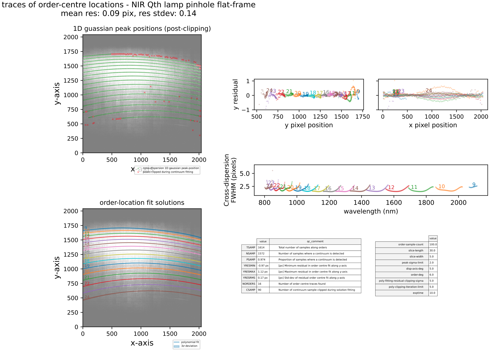

## soxs_order_centres

:::{include} ../../../recipes/descriptions/soxs_order_centres.inc
:::

### Usage

:::{include} ../../../recipes/cl_usage/soxs_order_centres.inc
:::

### Parameters

:::{include} ../../../recipes/parameters/soxs_order_centres.inc
:::

### Input

:::{include} ../../../recipes/inputs/soxs_order_centres.inc
:::

### Output

:::{include} ../../../recipes/output/soxs_order_centres.inc
:::

### QC Metrics

:::{include} ../../../recipes/qcs/soxs_order_centres.inc
:::

Plots similar to the one below are generated after each execution of [`soxs_order_centres`](#soxspipe.recipes.soxs_order_centres). The residuals of a 'good' fit typically have a mean and standard-deviation <0.2px.

:::{figure-md} soxs_order_centres_qc

A QC plot resulting from the `soxs_order_centres` recipe as run on a SOXS NIR single pinhole QTH flat lamp frame. The top-left panel shows the frame with green circles representing the locations on the cross-dispersion slices where a flux peak was detected. The red crosses show the centre of the slices where a peak failed to be detected. The bottom-left panel shows the global polynomial fitted to the detected order-centre trace with the different colours representing individual echelle orders. The top-right panels show the fit residuals in the X and Y axes. The bottom-right panel shows the FWHM of the trace fits (in pixels) with respect to echelle order and wavelength.

:::

