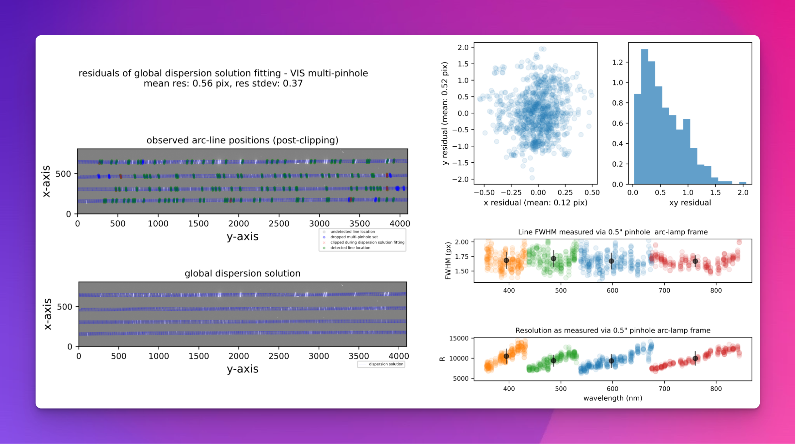

## soxs_spatial_solution

:::{include} ../../../recipes/descriptions/soxs_spatial_solution.inc
:::

### Usage

:::{include} ../../../recipes/cl_usage/soxs_spatial_solution.inc
:::

### Parameters

:::{include} ../../../recipes/parameters/soxs_spatial_solution.inc
:::

### Input

:::{include} ../../../recipes/inputs/soxs_spatial_solution.inc
:::

### Output

:::{include} ../../../recipes/output/soxs_spatial_solution.inc
:::

### QC Metrics

:::{include} ../../../recipes/qcs/soxs_spatial_solution.inc
:::

:::{figure-md} soxs_spatial_solution_qc

A QC plot resulting from the `soxs_spatial_solution` recipe. The top-left panel shows an SOXS VIS arc-lamp frame, taken with a multi-pinhole mask. The green circles represent arc lines detected in the image, and the blue circles and red crosses are lines that were detected but dropped because other pinholes of the same arc line were not detected, or because the lines were clipped during polynomial fitting. The grey circles represent arc lines reported in the static calibration table that were not detected in the image. The bottom-left panel shows the same arc-lamp frame with the dispersion solution overlaid as a blue grid. Lines travelling along the dispersion axis (left to right) are lines of equal slit position, and lines travelling in the cross-dispersion direction (top to bottom) are lines of equal wavelength. The top-right panel shows the residuals of the dispersion solution fit, and the bottom-right panel shows the resolution measured for each line (projected through the pinhole mask), with different colours for each echelle order and the mean order resolution in black.
:::

