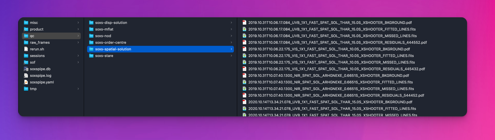
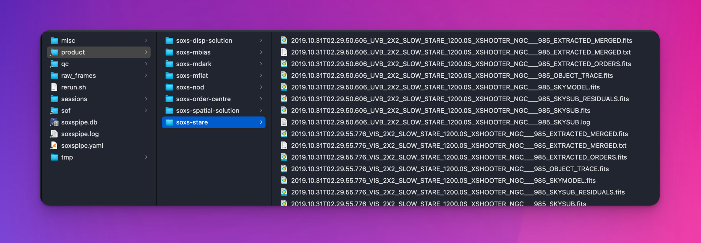

# Reducing Data with a Single Command

In most use cases, you will want to reduce all raw frames within your workspace with a single command. This allows you to run the pipeline at a high level without worrying about individual recipe commands. 

To do this, from the root directory of your workspace, run:

```bash
soxspipe reduce all .
```

Once running, the `reduce` command will execute the pipeline recipes (in order) and generate new data products. During execution, the pipeline writes useful logs to the terminal, providing a status of data-reduction progress. These logs are also written to [individual recipe log files](../logging.md). If, at any stage, a recipe fails to create a data product, the pipeline will attempt to pivot and use the next-best available product. The `reduce` command stops when all data within the workspace have been reduced.

During runtime, recipes write plots and files to a `qc` (Quality Control) folder within the workspace. Each recipe writes to its own named directory (see {numref}`qc_folder`).

:::{figure-md} qc_folder
{width=600px}

QC files and plots are written to the workspace `qc` folder.
:::


Each recipe generates products written to the `products` folder with the workspace, with each recipe writing to its own directory. Recipe log files are also written to the products folder adjacent to their associated products.

:::{figure-md} product_folder


Recipe products files and plots are written to the workspace `products` folder.
:::
