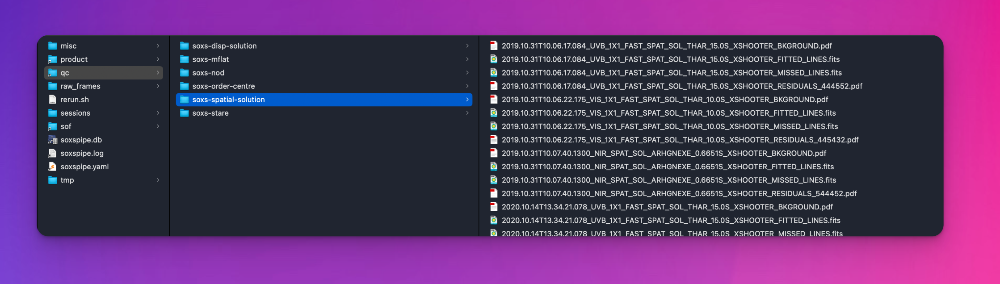
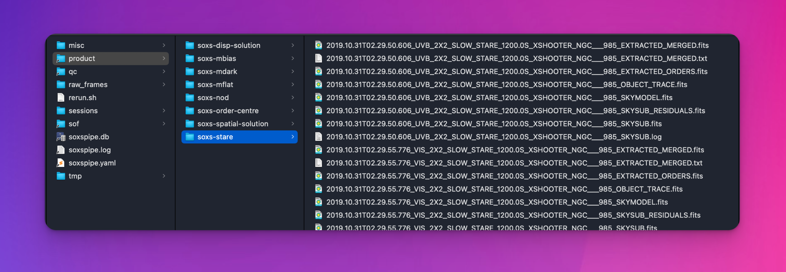
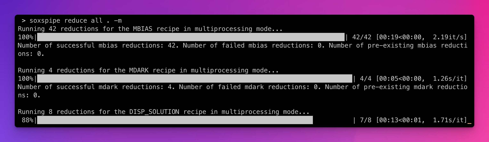

# Reducing Data with a Single Command

In most use cases, you will want to reduce all raw frames within your workspace with a single command. This allows you to run the pipeline at a high level without worrying about individual recipe commands.

To do this, from the root directory of your workspace, run:

```bash
soxspipe reduce all .
```

Once running, the reduce command will execute the pipeline recipes (in order) and generate new data products. During execution, the pipeline writes useful logs to the terminal, providing a status of data-reduction progress. These logs are also written to [individual recipe log files](http://../logging.md). If, at any stage, a recipe fails to create a data product, the pipeline will attempt to pivot to use the next-best available product. The reduce command stops when all data within the workspace has been reduced.

During runtime, recipes write plots and files to a qc (Quality Control) folder within the workspace. Each recipe writes to its own named directory (see {numref}qc_folder).

:::{figure-md} qc_folder
{width=600px}

QC files and plots are written to the workspace `qc` folder.
:::


Each recipe generates products written to the products folder within the workspace, with each recipe writing to its own directory. Recipe log files are also written to the products folder adjacent to their associated products.

:::{figure-md} product_folder


Recipe products, files and plots are written to the workspace products folder.
:::

## Speed up Reductions with Multiprocessing

If you have a large dataset, you can dramatically speed up reductions by using the `--multiprocess` (`-m`) flag. In this mode, the reduce command will reduce recipes in parallel. Instead of seeing each recipe's output logs in the terminal, the user will see a progress bar showing the pipeline's progress as it reduces all the sof files for each recipe.

To do this, from the root directory of your workspace, run:

```bash
soxspipe reduce all . -m
```

:::{figure-md} multiprocess


In multiprocessing mode, recipe sof files are reduced in parallel, and the user is presented with a progress bar for each recipe.
:::

## Targetting a Science SOF file for Reduction
