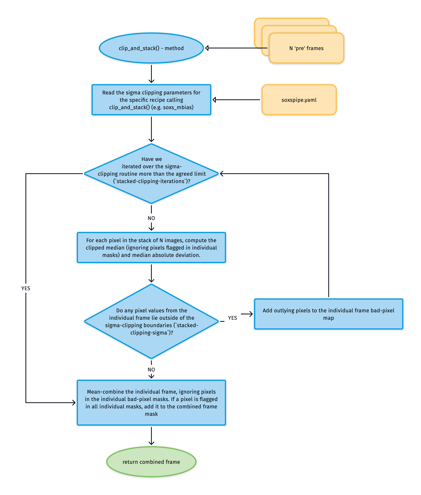

## `clip_and_stack`

[`clip_and_stack`](../_api/soxspipe.recipes._base_recipe_.html#soxspipe.recipes._base_recipe_._base_recipe_.clip_and_stack) mean combines input frames after sigma-clipping outlying pixels using a median value with median absolute deviation (mad) as the deviation function.

Before combining the frames we want to 'clip' any outlying pixel values found in the individual frames that are to be stacked. We isolate and remove pixels from any averaging calculation (mean or median) that have a value that strays too far from the 'typical' pixel value.

Using the median pixel value as the 'typical' value and the *median absolute deviation* (MAD) as a proxy for the standard-deviation we can accurately identify rogue pixels. For any given set of pixel values:

$$
MAD = \frac{1}{N}\sum_{i=0}^N |x_i - \text{median}(x)|.
$$

The clipping is done iteratively so newly found rogue pixels are masks, median values are recalculated and clipping repeated. The iterative process stops whenever either no more bad-pixels are to be found or the maximum number of iterations has been reached.

After the clipping has been completed individual frames are mean-combined, ignoring pixels in the individual bad-pixel masks. If a pixel is flagged as 'bad' in all individual masks it is added to the combined frame bad-pixel mask.




```eval_rst
.. automethod:: soxspipe.recipes._base_recipe_.clip_and_stack
```
