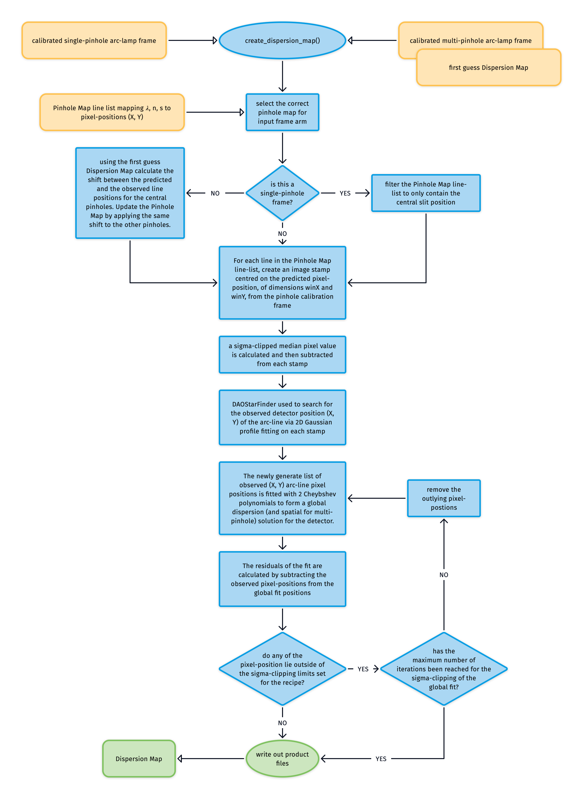
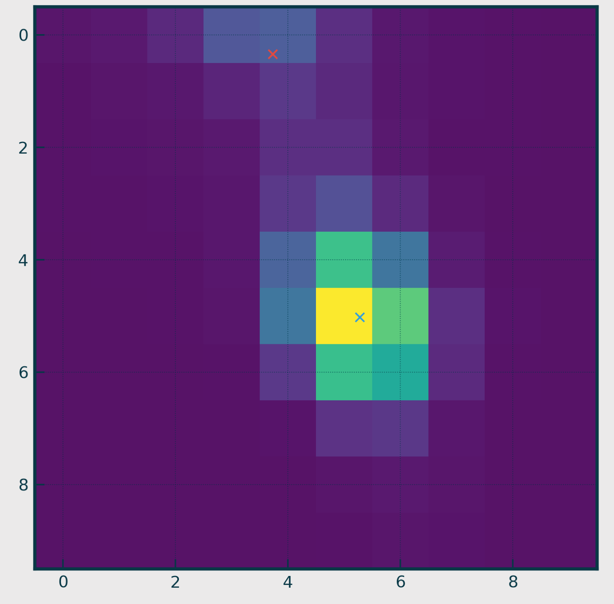
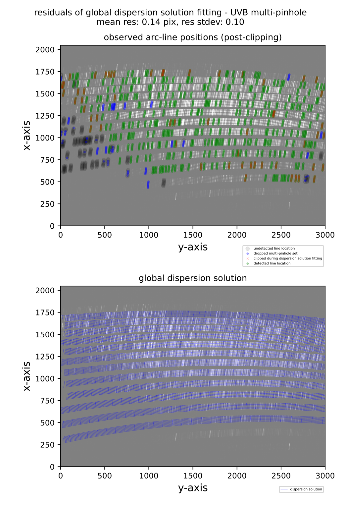
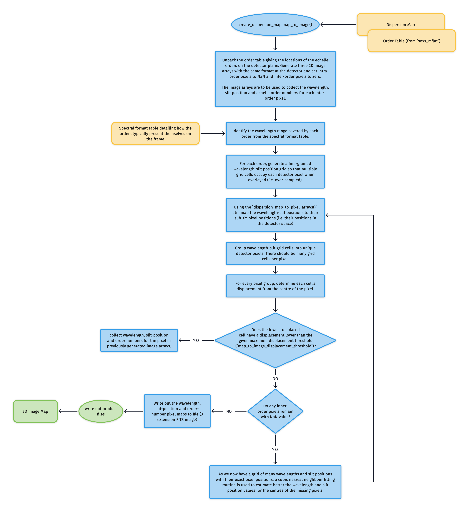
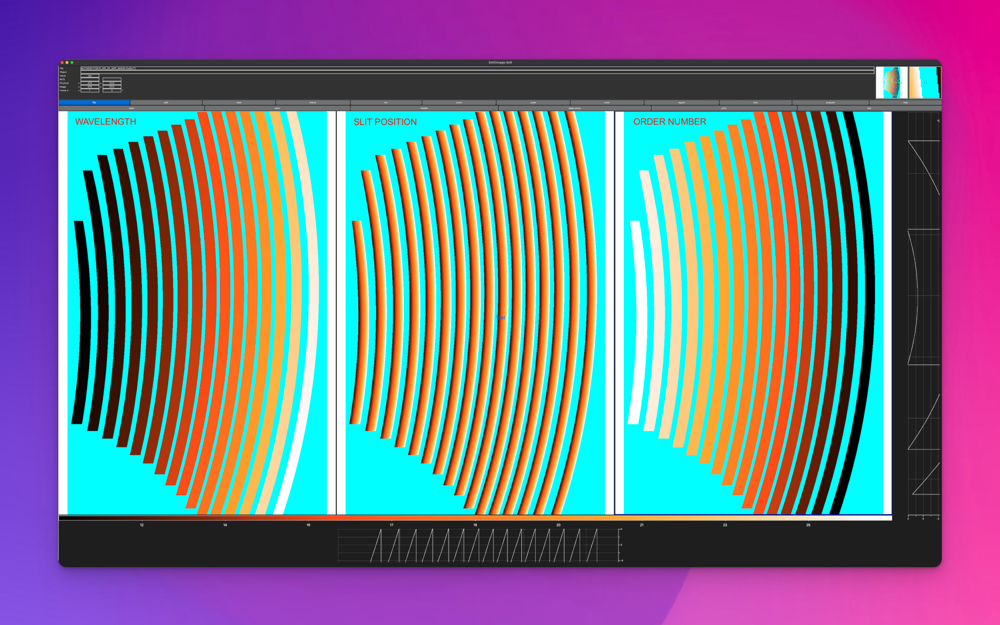

# create_dispersion_map

The [`create_dispersion_map`](#soxspipe.commonutils.create_dispersion_map) utility searches for emission line detections in arc-lamp frames imaged through pinhole masks. The measured line positions are then iteratively fitted with a set of polynomials to produce a global dispersion solution (and spatial solution in the case of a multi-pinhole frame). Both the [`soxs_disp_solution`](../recipes/soxs_disp_solution.md) and [`soxs_spatial_solution`](../recipes/soxs_spatial_solution.md) recipes use the utility.

:::{figure-md} create_dispersion_map_util
{width=600px}

This algorithm fits a dispersion solution to the SOXS or Xshooter spectral arms via calibration arc-lamp frames taken with single and multi-pinhole masks.
:::

The pipeline's static calibration suite contains arc line lists listing the wavelength $\lambda$, order number $n$ and slit position $s$ of arc lamp spectral lines alongside a first approximation of their ($X, Y$) pixel positions on the detector.

If the input arc frame was taken through the single-pinhole mask, the line list is filtered to contain just the central pinhole positions. If, however, the input is a multi-pinhole frame, then the first guess Dispersion Map (created with [`soxs_disp_solution`](../recipes/soxs_disp_solution.md)) is used to calculate the shift between the predicted and observed line positions for the central pinholes. The pixel positions for the entire line list are updated by applying the same pixel shift to the other pinholes.

For each line in the line list:

* An image stamp centred on the predicted pixel position ($X_o, Y_o$) of dimensions winX and winY is generated from the pinhole calibration frame.
* A sigma-clipped median pixel value is calculated and subtracted from each stamp.
* DAOStarFinder is employed to search for the *observed* detector position ($X, Y$) of the arc line via 2D Gaussian profile fitting on the stamp (see {numref}`arc_line_stamp`).

:::{figure-md} arc_line_stamp
{width=300px}

One of the stamps cut from a pinhole-masked arc-lamp frame. The stamp is selected using a window centred around the predicted pixel position of an arc line (read from the static calibration arc line list table). DAOStarFinder is then used to search for point-like sources on the stamp. In this stamp, two sources were found (each marked by an 'x'), with the source closest to the stamp's centre (blue 'x') chosen as the observed location of the arc line.
:::

We now have a list of arc-line wavelengths, their *observed* pixel positions, and the order in which they were detected. These values are used to iteratively fit two polynomials that describe the detector's global dispersion solution. In the case of the single-pinhole frames, these are:

$$X = \sum\limits_{ij} c_{ij} \times n^i \times \lambda^j$$

$$Y = \sum\limits_{ij} c_{ij} \times n^i \times \lambda^j$$

where $\lambda$ is wavelength and $n$ is the echelle order number.

In the case of the multi-pinhole, we also have the slit position $s$, and so add a spatial solution to the dispersion solution:

$$X = \sum\limits_{ijk} c_{ijk} \times n^i \times \lambda^j \times s^k$$

$$Y = \sum\limits_{ijk} c_{ijk} \times n^i \times \lambda^j \times s^k$$

Upon each iteration, the residuals between the fits and the measured pixel positions are calculated, and sigma-clipping is employed to eliminate measurements that stray too far from the fit. Once the maximum number of iterations is reached or all outlying lines have been clipped, the coefficients of the polynomials are written to a Dispersion map file.

:::{figure-md} spat_solu_qc
{width=601px}

A QC plot resulting from the `soxs_spatial_solution` recipe. The top panel shows an Xshooter UVB arc-lamp frame, taken with a multi-pinhole mask. The green circles represent arc lines detected in the image, and the blue circles and red crosses are lines that were detected but dropped as other pinholes of the same arc line failed to be detected or the lines were clipped during the polynomial fitting. The grey circles represent arc lines reported in the static calibration table that failed to be detected on the image. The bottom panel shows the same arc-lamp frame with the dispersion solution overlaid as a blue grid. Lines travelling along the dispersion axis (left to right) are lines of equal slit position, and lines travelling in the cross-dispersion direction (top to bottom) are lines of equal wavelength.
:::

## 2D Image Map

The Dispersion map is used to generate a triple-extension FITS file with each extension image exactly matching the dimensions of the detector (see {numref}`dispersion_map_image`). The first extension contains the wavelength value at the centre of each pixel location, the second the slit position, and the third the order number. The solutions for these images are iteratively converged in a brute-force manner (see {numref}`create_dispersion_map_to_image_util`}). These image maps are used in sky-background subtraction and object extraction utilities. 

:::{figure-md} create_dispersion_map_to_image_util
{width=600px}

This is the algorithm used to transform the dispersion solution into a 2D image map, with individual FITS extensions for wavelength, slit position, and order number.
:::

:::{figure-md} dispersion_map_image
{width=600px}

A 2D dispersion solution image map; a triple-extension FITS file with each extension image exactly matching the dimensions of the detector. The first extension contains the wavelength value at the centre of each pixel location, the second the slit position, and the third the order number.
:::

### Utility API

:::{autodoc2-object} soxspipe.commonutils.create_dispersion_map.create_dispersion_map
:::

