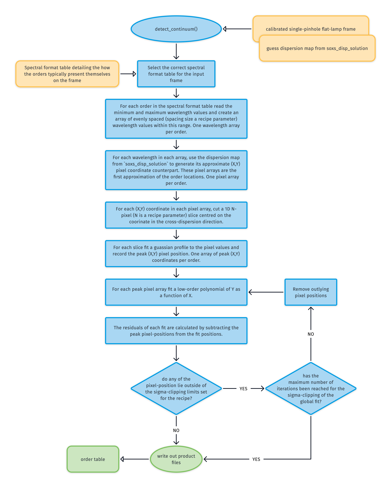
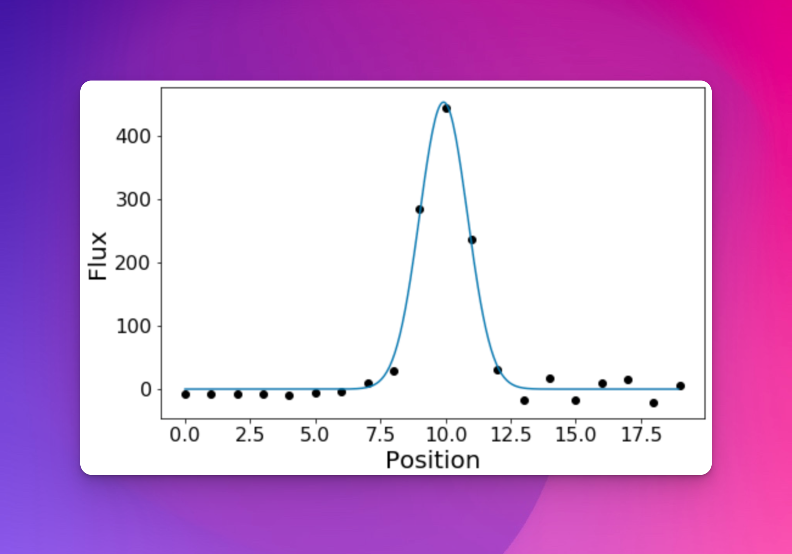
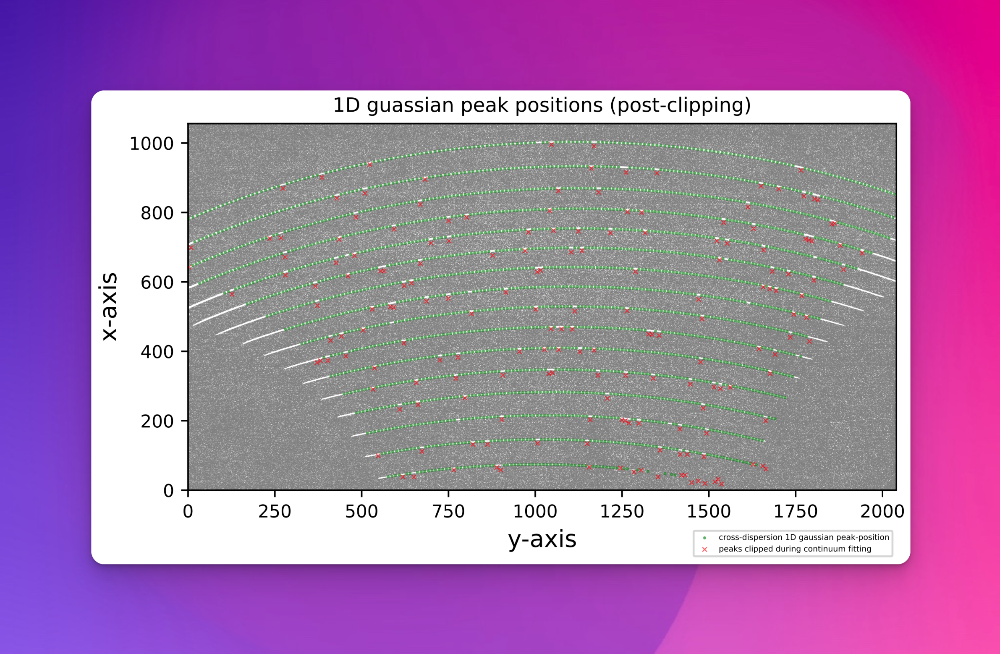
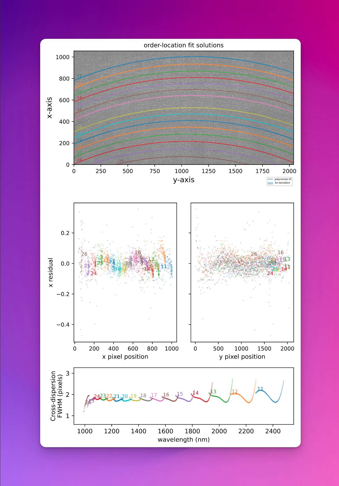

# detect_continuum

The `detect_continuum` utility locates and fits a trace using a low-level polynomial across all echelle orders.

:::{figure-md} detect_continuum_util
{width=600px}

The algorithm used to fit a source trace across all the echelle orders.
:::

The [`detect_continuum`](#soxspipe.commonutils.detect_continuum) utility takes an image frame containing a source trace as input. This trace could be from a calibration lamp (as used in the [`soxs-order-centres`](../recipes/soxs_order_centres.md) recipe, see {numref}`pinhole-flat-image`) or an astrophysical object; the algorithm to fit the trace is the same.

:::{figure-md} pinhole-flat-image
{width=600px}

A 15-second QTH flat-lamp exposure through a pinhole mask onto the SOXS NIR detector.
:::

From a spectral format table (specific to the arm in question), the minimum and maximum wavelength values for each order are known. The first guess dispersion map generated by [`soxs_disp_solution`](../recipes/soxs_disp_solution.md) generates an array of pixel locations along the centre of each order between these wavelength limits.

Centred on each pixel position, an N-pixel long (`slice-length` recipe parameter), M-pixel wide (`slice-width` recipe parameter) image slice is taken in the cross-dispersion direction. Each slice is collapsed to 1 pixel in width by taking the median pixel value at each location along the length of the slice. A 1D gaussian is fitted to the flux in each slice, and if a peak is registered with more than a `peak-sigma-limit` sigma significance, the pixel-position is stored (see {numref}`gaussian-fitting` and {numref}`peak-fits`).

:::{figure-md} gaussian-fitting
{width=600px}

An attempt is made to fit a Gaussian to the flux in each slice. The pixel position is stored if a peak is registered with more than a `peak-sigma-limit` sigma significance.
:::

:::{figure-md} peak-fits
{width=600px}

The green circles represent the location on the cross-dispersion slice where a flux peak was detected. The red crosses show the centre of the slices where a peak failed to be detected.
:::

Finally, the entire set of Gaussian peak pixel positions is iteratively fitted with a polynomial:

$$
X = \sum\limits_{ij} c_{ij} \times n^i \times Y^j
$$

where $X$ and $Y$ are the pixel positions and $n$ is the echelle order number. $i$ and $j$ are the polynomial degree orders for the echelle order (`order-deg`) and $Y$ pixel position (`disp-axis-deg`) respectively. $c_{ij}$ are the polynomial coefficients to be fitted. The polynomial is iteratively fitted while sigma-clipping pixel-positions with outlying residuals. As this is a global fit to the source trace across all orders, even if the source is very faint in a few orders, it still has a good chance of fitting a trace. The final results are stored in an order location table.

:::{figure-md} trace_fit_image
{width=600px}

The top panel show the global polynomial fitted to the detected source trace with the different colours representing individual echelle orders. The middle panels show the fit residuals in the X and Y axes. The bottom panel shows the FWHM of the trace fits (in pixels) with respect to echelle order and wavelength.
:::

## Utility API

:::{autodoc2-object} soxspipe.commonutils.detect_continuum.detect_continuum
:::

