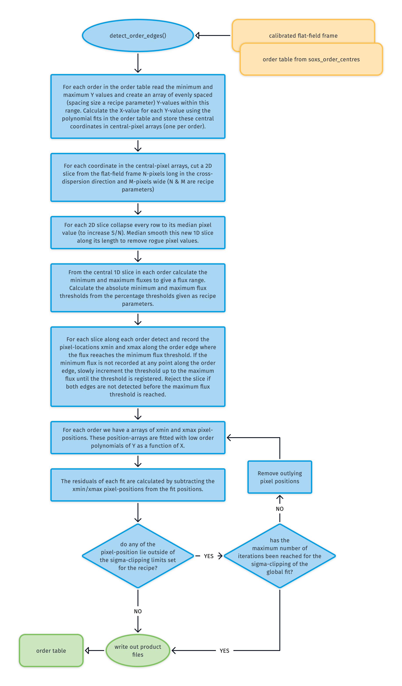
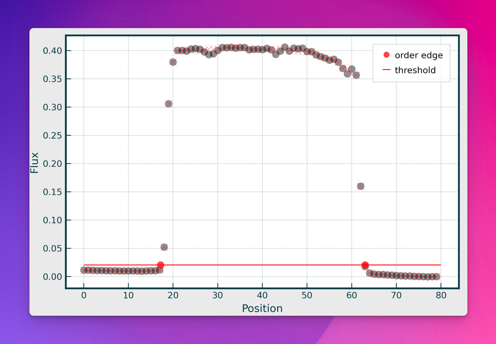
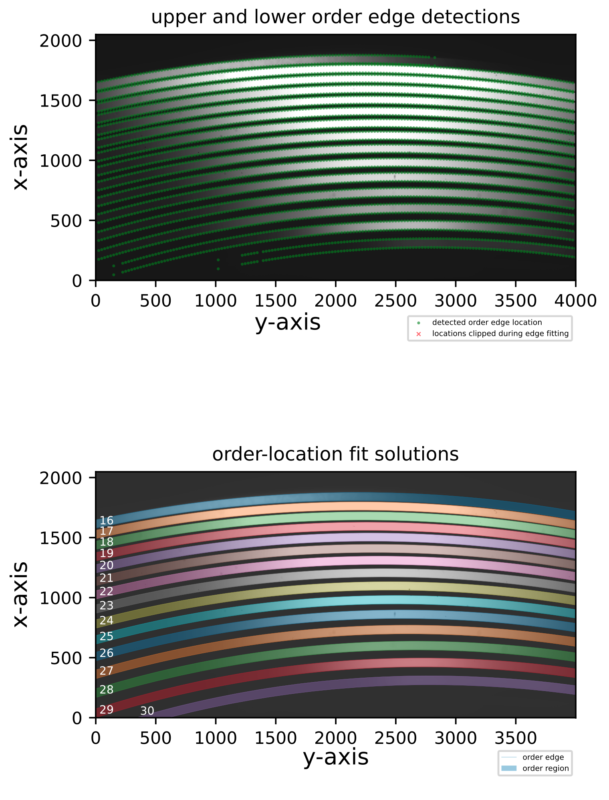

# detect_order_edges

The [`detect_order_edges`](#soxspipe.commonutils.detect_order_edges) utility uses a fully-illuminated slit flat-lamp frame to detect and fit the edges of each echelle order across the detector plane.

:::{figure-md} detect_order_edges_util
:target: detect_order_edges.png
{width=600px}

This algorithm detects and fits the edges of the echelle orders across the detector plane.
:::

The utility takes as input a fully illuminated slit image (flat-field frame). The second input is the order table generated by the [`soxs_order_centres`](../recipes/soxs_order_centres.md) recipe, which provides a trace of the centre of each order along the dispersion axis.

An array of central pixel positions is generated using the order table for each order. At each pixel position in these arrays, an N-pixel long (`slice-length-for-edge-detection`), M-pixel wide (`slice-width-for-edge-detection`) image slice in the cross-dispersion direction is cut from the flat-frame. Each 2D slice is collapsed to a 1D array by taking the median value across its width (ignoring masked pixels). 

The minimum and maximum fluxes are calculated from the central 1D slice in each order to give a flux range. The absolute minimum and maximum flux thresholds are determined from the percentage thresholds given as recipe parameters (`min-percentage-threshold-for-edge-detection` and `max-percentage-threshold-for-edge-detection`). If the minimum threshold were set at 25%, then the absolute flux would be:

$$
threshold = minvalue + (maxvalue - minvalue) * 0.25
$$

For each slice along each order, the pixel-locations xmin (lower edge) and xmax (upper edge) where the flux reaches this minimum flux threshold are detected and recorded (see red circles in {numref}`order-edge-slice`). If the minimum flux is not recorded at any point along the order edge, the threshold slowly increments to the maximum flux until the threshold is registered. Slices where both edges are undetected before the maximum flux threshold is reached are rejected.

:::{figure-md} order-edge-slice
:target: ../_images/image-20240911115628697.png

A single slice cut across the cross-dispersion axis of an echelle order. The grey dots represent the median flux from the width-collapsed 1D slice. The red dots show where a pre-determined flux threshold is reached, and the pixel positions at these locations are registered as the lower and upper edges of the order as measured in this slice.
:::

For each order, a median order height ($xmax-xmin$) is determined, and $xmin$ and $xmax$ are adjusted for each slice, so each order now has the same pixel height across the order. This helps fit the order edges at the extremes of the detector plane where flux from the flat lamp can be reduced.

Finally, for each order, the arrays of $xmin$ and $xmax$ pixel-positions are iteratively fitted with low order polynomials:

$$
X = \sum\limits_{ij} c_{ij} \times n^i \times Y^j
$$

where $X$ and $Y$ are the pixel positions and $n$ is the echelle order number. $i$ and $j$ are the polynomial degree orders for the echelle order (`order-deg`) and $Y$ pixel position (`disp-axis-deg`) respectively. $c_{ij}$ are the polynomial coefficients to be fitted. The polynomial is iteratively fitted while sigma-clipping pixel-positions with outlying residuals (see {numref}`order-edge-fits`). The new [order table](../files/order_table.md) is written to file and now includes the upper and lower-edge locations alongside the central location for each order.

:::{figure-md} order-edge-fits
:target: ../_images/image-20240911121836550.png

The top panel shows the upper and lower-order edge detections registered in the individual cross-dispersion slices in an Xshooter VIS flat frame. The bottom panel shows the global polynomial fits to the upper and lower-order edges, with the area between the fits filled with different colours to reveal the unique echelle orders across the detector plane.
:::

## Utility API

:::{autodoc2-object} soxspipe.commonutils.detect_order_edges.detect_order_edges
:::
