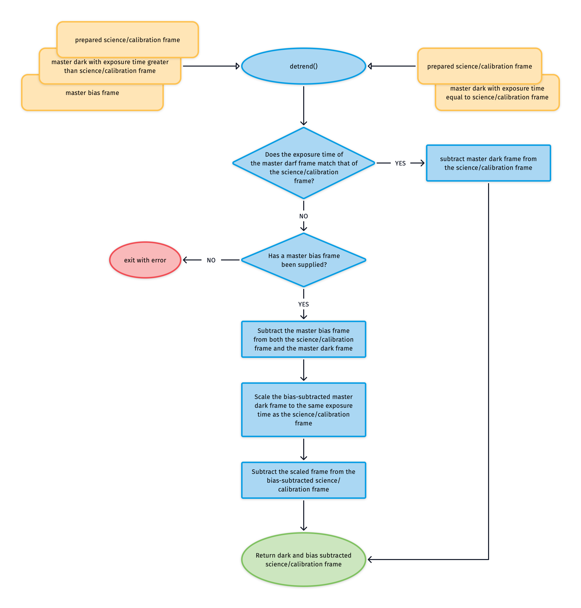

## `detrend` - SEMI-COMPLETED

For the UVB-VIS arm we will often need to scale the master-dark frame to match the exposure time of our science/calibration frame. If this is the case than the master-bias frame needs to be subtracted from the master-dark frame before scaling. However, if the master-dark frame has the same exposure time as your science/calibration frame then it can be subtracted directly from frame as this serves to remove the bias and dark-current contributions simultaneously. 

This logic is all housed within the [`detrend`](../_api/soxspipe.recipes._base_recipe_.html#soxspipe.recipes._base_recipe_._base_recipe_.detrend) method.

