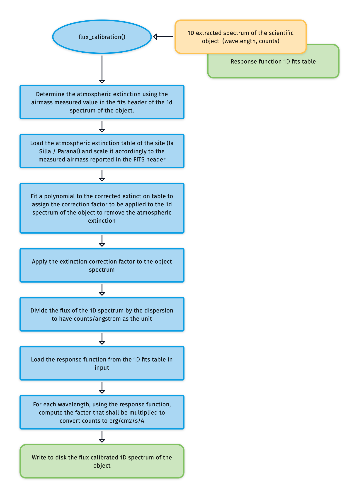

# flux_calibration

The [`flux_calibration`](#soxspipe.commonutils.flux_calibration) utility flux calibrates a scientific spectrum by applying the response function computed by the [`response_function`](#soxspipe.commonutils.response_function) utility.

## Input

| Frame.                   | Description                                   | 
| ------------------------ | --------------------------------------------- |
| Extracted  1D scientific spectrum | FITS table containing the 1D spectrum (any observing mode) of the object to be flux calibrated |  
| Extinction curve | FITS table containing the tabulated value of the observing site's extinction curve (wavelength, mag per airmass).|
| Response function | FITS table containing the fit parameters modelling the response function calculated by [`response_function`](#soxspipe.commonutils.response_function) utility |

## Parameters

N/A

## Method
The general algorithm and steps performed by [`flux_calibration`](#soxspipe.commonutils.flux_calibration) are the one reported in the flow chart below:

:::{figure-md} flux_calibration_util
:target: flux_calibration.png

{width=600px}

The algorithm used flux to calibrate a scientific spectrum by applying a response function.
:::

In detail, the airmass at the time of observation is computed as an average between its values at the beginning and end of the observation, using the FITS header of the extracted 1D scientific spectrum.
Then, the utility loads the extinction curve (a table with wavelength and extinction coefficient $mag_{airmass}$) and rescales it to the airmass calculated before. The extinction curve is then interpolated on a finer grid, which is suitable for application to the extracted scientific spectrum using a nearest neighbour interpolation schema.

The extracted scientific spectrum is then corrected for airmass for each wavelength as follows:

$$
fluxCorrected_{\lambda} = fluxObserved_{\lambda} \times 10^{AM \times mag_{airmass}}
$$

Then, the value (in counts) for each wavelength is divided by the dispersion of the spectrograph and by the exposure time reported in the `EXPTIME` keyword. At this stage, the 1D spectrum of the scientific object has units of $ADU$ $s^{-1}$ $A^{-1}$. To finalize the flux calibration, the utility loads the FITS table that contains the fit parameters for the response function given in input to compute the flux calibrated spectrum for each wavelength, applying the formula

$$
F(\lambda) = \frac{C(\lambda)}{S(\lambda)}
$$

where $F(\lambda)$ is the desired 1D scientific spectrum flux calibrated in $erg$ $cm^{-2}$ $s^{-1}$ ${A^{-1}}$, $C(\lambda)$ is the scientific spectrum in counts and $S(\lambda)$ is the response function.

## Output

| Data Type | Content |
| ------------------------ | --------------------------------------------- |
|FITS table |FITS table containing the flux calibrated input spectrum|

<!-- ## Utility API

:::{autodoc2-object} soxspipe.commonutils.flux_calibration.flux_calibration
:::
 -->
