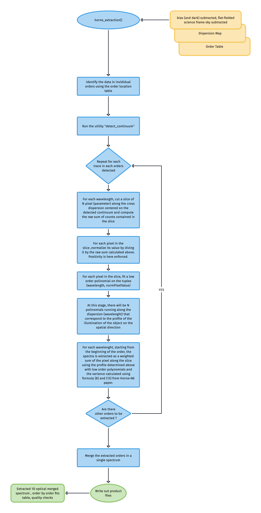

# `horne_extraction` -- PLANNED 

The purpose of the [`horne_extraction`](#soxspipe.commonutils.horne_extraction) utility is to perform optimal extraction on each spectral order applying the algorithms reported in Horne+86.

The typical execution workflow is the following:

This utility, according to the prescrption of Horne+86, follows those basic steps:

** 1. Determination of the spatial profile

Starting from the order_table computed by the detect_continumm utility, the horne_extraction utility runs along the spectral direction and takes, for each wavelenght centered in the position measured by the detect_continuum utility, a window of 1xhorne-extraction-slit-length. Then, the pixels are summed and each pixel in the slice is normalized as 

$pixel_i = \frac{Flux_{pixel_i}}{\sum_{j=0}^{horne-extraction-slit-length}{Flux_{pixel_j}}}$. 

Then, for each pixel in the slice along the dispersion a low order polynomial is fitted. This polynomial models the value of the fractional flux received in this pixel by the object along the dispersion. The full set of horne-extraction-slit-length represent the profile of the object along the spatial direction for each wavelenght.

When the procedure above is completed, the actual extraction takes place as follows:

** 2. Extraction of the spectrum for each wavelength

Using the polynomials computed above, the extracted integrated flux for each wavelenght in the order is computed as:

