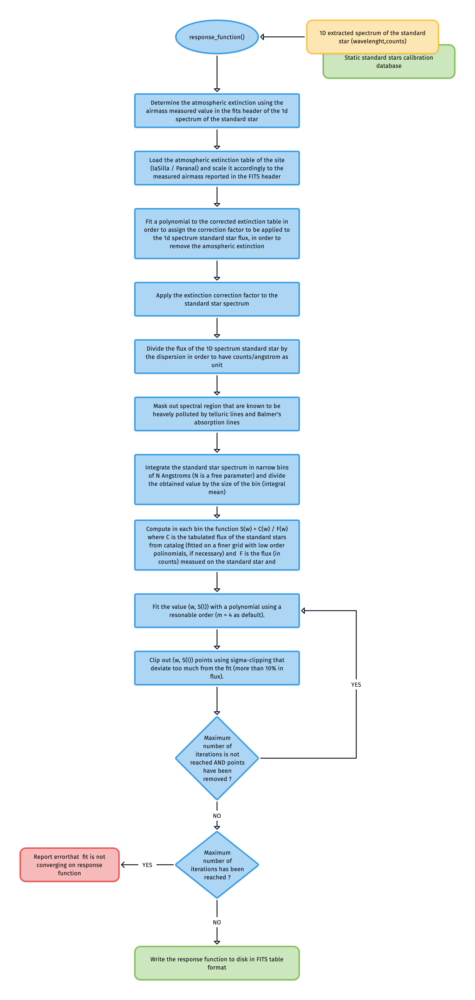

# `response_function` 

The purpose of the [`response_function`](#soxspipe.commonutils.response_function) utility is to compute the response function of the SOXS spectrograph, starting from observation of a suitable bright standard star. The function computed by this utility is used to flux calibrate the scientific spectra, converting from ADU to $erg cm^{-2} s^{-1} \AA^{-1}$.

The general algorithm and steps performed by [`response_function`](#soxspipe.commonutils.response_function) are the following reported in the flow chart below:

In details, this utility first determines the average airmass at which the standard star, provided as input, has been observed. Then, it loads the standard extinction curve, provided as a FITS table with wavelenght and $mag_{airmass}$ for the observing site (La Silla for NTT/SOXS), and corrects the observed flux (in counts) accordingly applying the formula

$$
fluxCorrected_{\lambda} = fluxObserved_{\lambda} \times 10^{AM \times mag_{airmass}}
$$ 

Please note that in order to cope with different discretisation of the tabulated extinction curve and the observed spectrum, the former is fitted with a nearest neighbour interpolation schema.

The $fluxCorrected_{\lambda}$ values are then converted in $ADU {\AA}^{-1} s^{-1}$ by diving for the value contained in the `EXPTIME` keyword of the standard star spectrum and for the dispersion measured at each pixel. According to the considered arm (UVVIS, NIR) regions that are known to be polluted by significant telluric absorptions or strong Lyman or Balmer/Paschen lines are masked out.

The observed standard star spectrum is then averaged in narrow bins of about 10 $\AA$ in order to increase the signal-to-noise ratio (a sort-of narrow band photometry). Then, from the tabulated value of the standard star catalogue (reinterpolated on a suitable grid), the function

$$
S(\lambda) = \frac{C(\lambda)}{F(\lambda)}
$$    
where $C(\lambda)$ is the tablued value of the standard star flux in catalogue (in $erg cm^{-2} s^{-1} \AA^{-1}$) and $F(\lambda)$ is the flux (in ADU) measured on the standard star.

The different values of $S(\lambda)$ are fitted with a polynomial of 4th order (as default) or ... using a standard iteration schema. At each interation, data are fitted and points for which they residuals deviate more than .... are clipped for the next iteration (with a maximum of).

If the fit did not converge, [`response_function`] raises an exeception otherwise a FITS table containing the parameters of the fit is saved.

