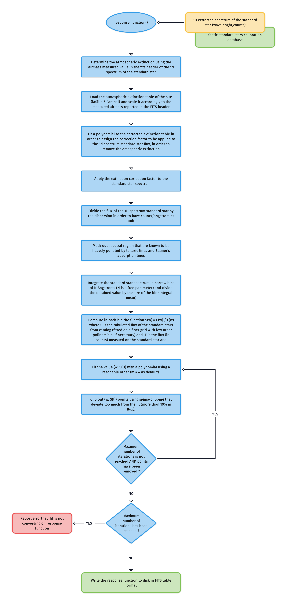
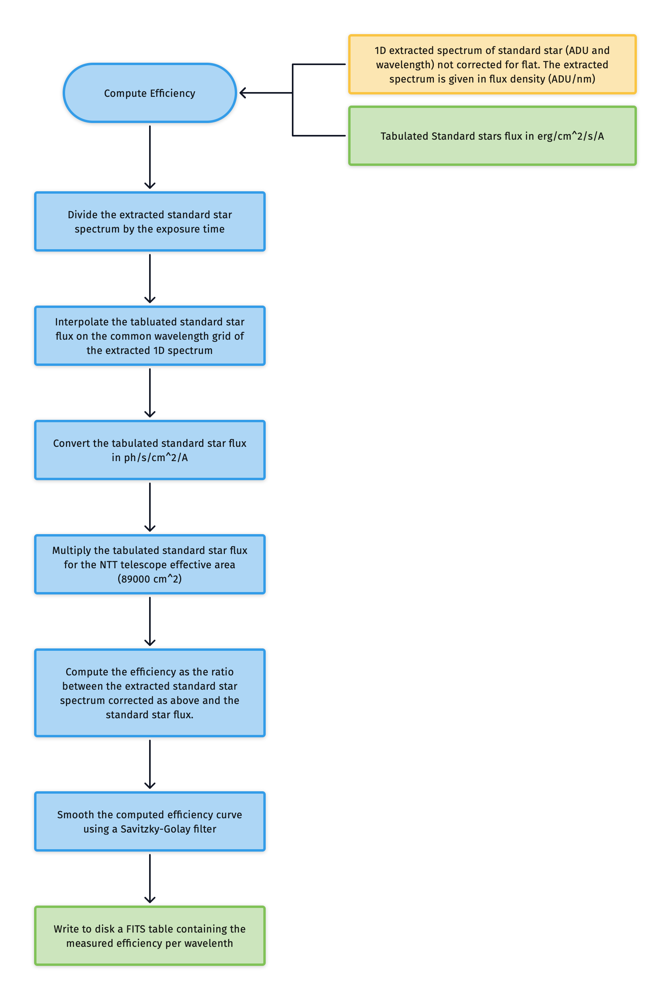
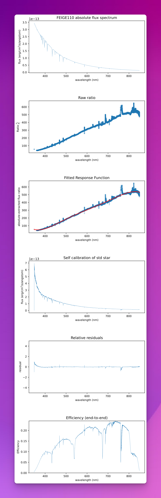

# response_function

The [`response_function`](#soxspipe.commonutils.response_function) utility computes the spectrograph's response function, using an observation of a suitable bright standard star. The function computed by this utility is used to flux calibrate the scientific spectra, converting from ADU to $erg$ $cm^{-2} s^{-1} A^{-1}$.

The general algorithm and steps performed by [`response_function`](#soxspipe.commonutils.response_function) are reported in the {numref}`response_function_util`.

:::{figure-md} response_function_util
{width=600px}

The algorithm used to compute the spectrograph's response function.
:::

In detail, this utility first determines the average airmass at which the standard star, provided as input, has been observed. Then, it loads the standard extinction curve, supplied as a FITS table with wavelength and $mag_{airmass}$ for the observing site (La Silla for NTT/SOXS), and corrects the observed flux (in counts) accordingly, applying the formula:

$$
fluxCorrected_{\lambda} = fluxObserved_{\lambda} \times 10^{AM \times mag_{airmass}}
$$

Please note that the tabulated extinction curve and the observed spectrum are fitted with a nearest-neighbour interpolation schema to cope with the different discretisations.

The $fluxCorrected_{\lambda}$ values are then converted in $ADU$ ${A}^{-1} s^{-1}$ by diving for the value contained in the `EXPTIME` keyword of the standard star spectrum and for the dispersion measured at each pixel. According to the considered arm (UV-VIS, NIR), regions that are known to be polluted by significant telluric absorptions or strong Lyman or Balmer/Paschen lines are masked out.

The observed standard star spectrum is then averaged in narrow bins of about 10 $A$ to increase the signal-to-noise ratio (a sort of narrow-band photometry). Then, from the tabulated value of the standard star catalogue (interpolated on a suitable grid), the function:

$$
S(\lambda) \propto \frac{C(\lambda)}{F(\lambda)}
$$

where $C(\lambda)$ is the tabulated value of the standard star flux in the catalogue (in $erg$ $cm^{-2} s^{-1} A^{-1}$), and $F(\lambda)$ is the flux (in ADU) measured on the standard star.

The different values of $S(\lambda)$ are fitted with a polynomial of 4th order (as default) or `soxs-response-poly_order` using a standard iteration schema. For each iteration, data are fitted, and points for which the residuals deviate more `soxs-response-sigma_clipping_threshold` standard deviations are clipped for the next iteration (with a maximum of `soxs-response-max_iteration` number of iterations).

If the fit does not converge, `response_function` raises an exception; otherwise, a FITS table containing the fit's parameters is saved.

## Efficiency Calculation

:::{figure-md} response_function_eff_util
{width=600px}

The algorithm used to compute the telescope and instrument efficiency.

:::

During the computation of the response function, the `get()` method performs an evaluation of the efficiency of the instrument as the ratio between the measured counts from the observed and _not_ flat field corrected standard star spectrum and the expected number of counts from tabulated flux values of known standard stars.

In detail, the `get()` method searches the FITS header for the standard name to load the tabulated expected flux value from the static calibration assets for the observed standard star. It then divides the observed spectrum by the exposure time (`EXPTIME` keyword in the FITS header) and reinterpolates the tabulated standard star fluxes onto the same wavelength grid as the observed spectrum. The tabulated flux values are then converted into ph s$^{-1} cm^{-2} \AA^{-1}$ and multiplied by the effective NTT telescope area (89,000 cm$^2$). Finally, the observed standard star spectrum is divided by the tabulated standard star fluxes (adjusted as discussed above) to obtain the estimate of the end-to-end efficiency, which is smoothed using a standard Savitzky-Golay filter with $\sigma$ = 21.

:::{figure-md} response_curve_util

The output of the `reponse_function` utility used in the reduction of spectroscopic standard star spectra. The third panel shows th fittted response curve, and the final panel shows the overall efficiency of the instrument across the entire wavelength range of the spectrograph arm. 

:::

### Utility API

:::{autodoc2-object} soxspipe.commonutils.response_function.response_function
:::
