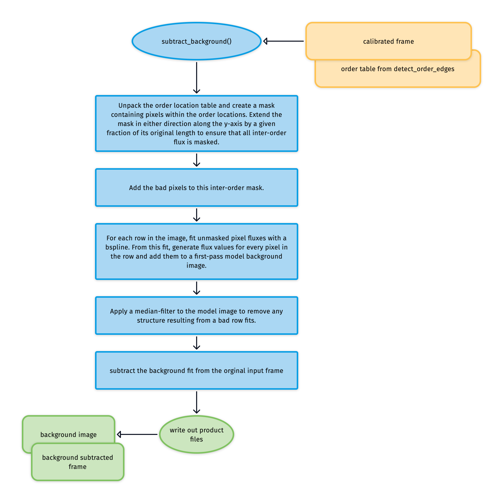
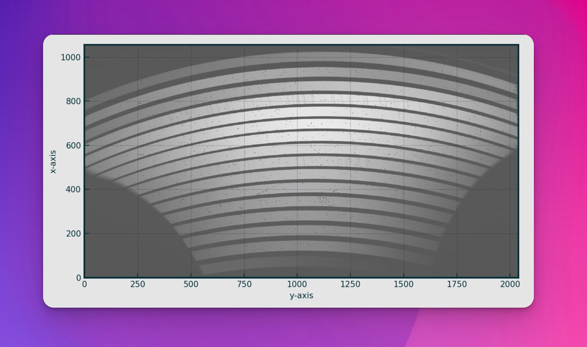
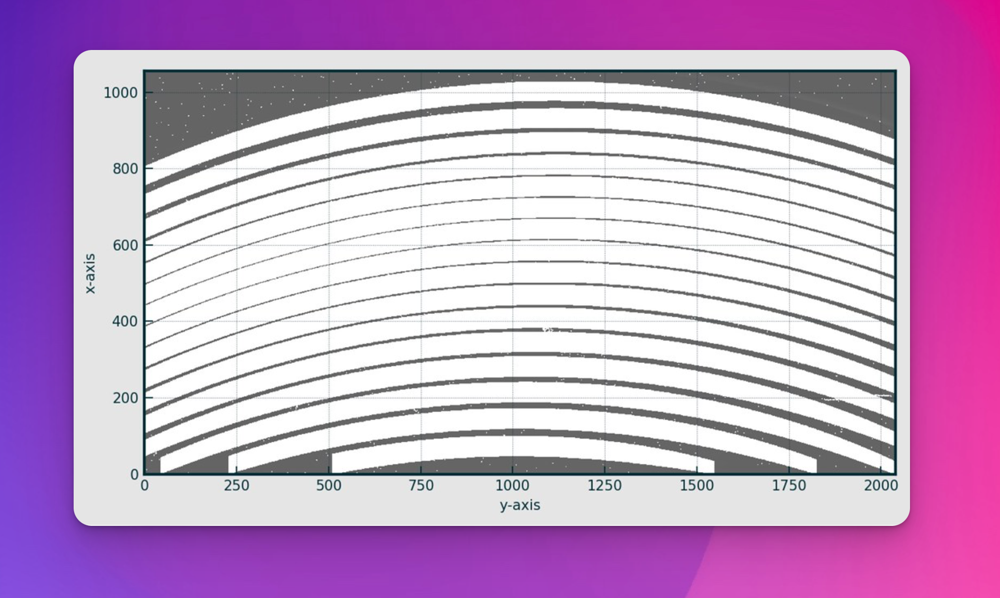
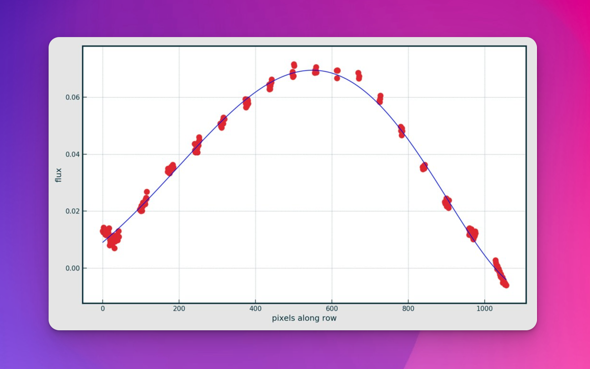
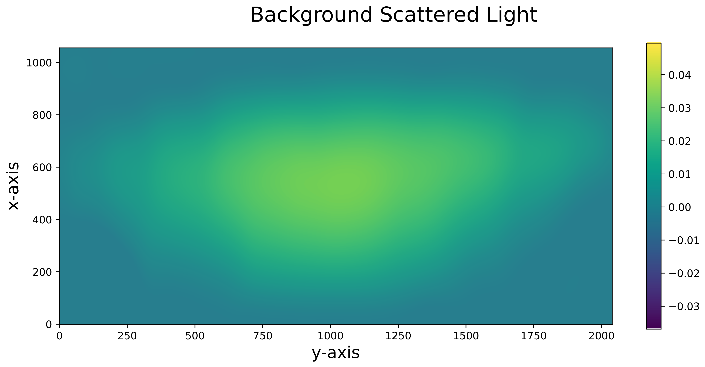

# subtract_background

The [`subtract_background`](#soxspipe.commonutils.subtract_background) utility fits, models and removes the background scattered light within an image.

Here's the workflow for subtracting a frame's background:

:::{figure-md} subtract_background_util
{width=600px}

The algorithm fits, models, and subtracts the scattered background light from an image.
:::

{numref}`raw_frame_with_background_light` shows an example frame with background scattered light present. The first task of the utility is to use the order location table to mask pixels within the echelle orders and the locations of bad pixels (see {numref}`raw_frame_with_background_light_masked`).

:::{figure-md} raw_frame_with_background_light
{width=600px}

An example NIR lamp flat frame containing scattered background light.
:::

:::{figure-md} raw_frame_with_background_light_masked
{width=600px}

The NIR lamp flat now with inter-order and bad pixels masked.
:::

For each column in the masked frame, a bspline is fitted to the unmasked fluxes to model the shape of the scattered background light along the entire column length (including the masked regions). See {numref}`background_spline`.

:::{figure-md} background_spline
{width=600px}

The red points are the unmasked data located along a single column in the masked frame. The blue line is the bspline fitted to the data, providing a model for the scattered background light contaminating the inter-order regions.
:::

A Gaussian filter is applied to the image to remove the structure resulting from bad row fits, and finally, the modelled background image is subtracted from the original frame. 

:::{figure-md} background_iamge_blurred
{width=600px}

The final image of the model background scattered light, which is then subtracted from the original data frame.
:::

## Utility API

	:::{autodoc2-object} soxspipe.commonutils.subtract_background.subtract_background
	:::
