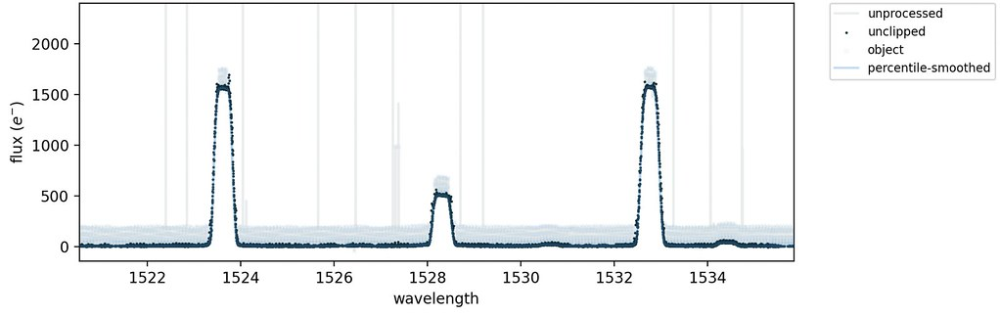
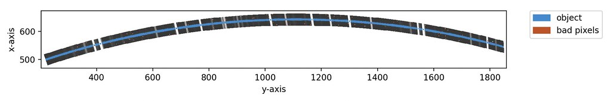
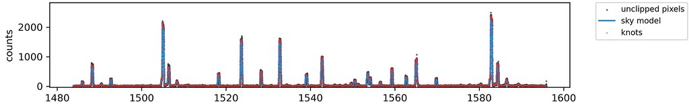
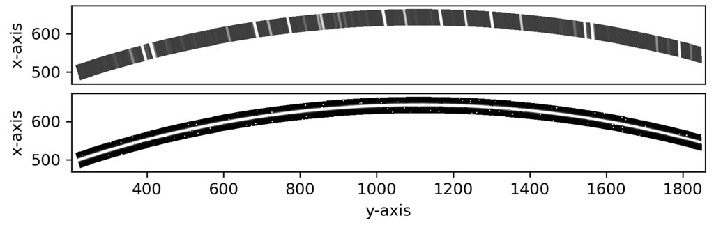

# subtract_sky

The [`subtract_sky`](#soxspipe.commonutils.subtract_sky) utility uses the on-frame data provided in a two-dimensional spectral image to accurately model the sky background, which is removed from the original data frame.

The Kelson Background Subtraction method, initially outlined in {cite:t}`kelson2003`, attempts to make optimal use of all data provided in a two-dimensional spectral image to accurately model a sky background image, which can then be removed from the original data frame. The method allows sky-subtraction to be performed in the early stages of the data-reduction process (just after flat-fielding) with no need first to identify and isolate cosmic-ray hits or other bad-pixel values.

:::{figure-md} subtract_sky_util
:target: sky_background_subraction.png
{width=600px}

The algorithm used to model and subtract the sky-flux from data taken in stare mode.
:::

## Utility API

:::{autodoc2-object} soxspipe.commonutils.subtract_sky.subtract_sky
:::
